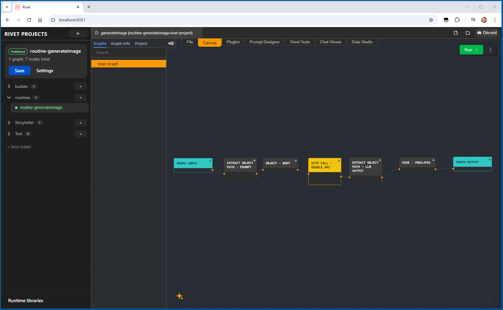

# Rivet Studio Server

Rivet Studio Server is the self-hosted browser editor and workflow-serving
platform that lives inside the Rivet monorepo. It provides:

- the Rivet editor in a browser
- folder and project management
- one-click workflow endpoint publication
- run recordings and replay
- the latest-workflow remote debugger
- runtime-library management for Code nodes
- UI, web-app, and workflow-endpoint access controls



## Documentation

- [Architecture](../../developer-docs/studio-server/architecture.md)
- [Access and routing](../../developer-docs/studio-server/access-and-routing.md)
- [Development](../../developer-docs/studio-server/development.md)
- [Kubernetes](../../developer-docs/studio-server/kubernetes.md)
- [Repository structure](../../developer-docs/studio-server/repo-structure.md)
- [Monorepo migration](../../developer-docs/studio-server/monorepo-migration.md)
- [Editor bridge](../../developer-docs/studio-server/editor-bridge.md)
- [Workflow publication](../../developer-docs/studio-server/workflow-publication.md)
- [Runtime libraries](../../developer-docs/studio-server/runtime-libraries.md)

## Monorepo Map

- `packages/studio-server-api/`: control-plane and execution-plane API
- `packages/studio-server-web/`: dashboard, hosted editor, and browser tests
- `packages/studio-server-executor/`: Node executor service
- `packages/studio-server-shared/`: browser/server contracts
- `packages/studio-server-bootstrap/`: API and executor process bootstrap
- `deploy/studio-server/images/`: production image definitions
- `deploy/studio-server/compose/`: Docker Compose stacks and proxy config
- `deploy/studio-server/helm/`: Kubernetes chart and overlays
- `deploy/studio-server/scripts/`: launchers and deployment verification
- `developer-docs/studio-server/`: architecture, operator, and contributor docs

All Rivet and Studio Server packages use the root Yarn workspace and one root
lockfile. There is no nested Rivet checkout, source clone step, package-link
overlay, or second dependency installation.

## Prerequisites

- Node.js 24+
- Corepack/Yarn using the release pinned by this repository
- Docker and Docker Compose for containerized development or deployment
- Git

Install the complete monorepo from the repository root:

```bash
corepack enable
yarn install --immutable
```

The former standalone npm command surface is retired. Update existing VM
automation as follows; no compatibility aliases are provided:

| Former command        | Monorepo command                                   |
| --------------------- | -------------------------------------------------- |
| `npm install`         | `corepack enable`, then `yarn install --immutable` |
| `npm run prod`        | `yarn studio-server:prod`                          |
| `npm run prod:custom` | `yarn studio-server:prod:custom`                   |

`yarn dev` remains the Rivet desktop/editor development command. Studio Server
development and deployment always use the `studio-server:*` namespace.

## Production Docker

Create `.env` from `deploy/studio-server/.env.example`, then run:

```bash
yarn studio-server:prod
```

This pulls the published
`ghcr.io/valerypopoff/rivet2.0-studio-server/*` images, recreates the
stack, and waits for it to become healthy. These are new, monorepo-owned packages; the retired `cloud-hosted-rivet2-wrapper/*` packages are not updated by this repository. The default browser URL is
`http://localhost:8080`; set `RIVET_PORT` to change it.

The production launcher detects the one existing historical Studio Server
app-data volume—either `compose_rivet_data` or `ops_rivet_data`—and uses the
matching Compose project so an in-place upgrade retains server settings and
filesystem-backed SQLite state. `compose` is the fresh-install default. If both
legacy volumes exist, set `RIVET_STUDIO_SERVER_COMPOSE_PROJECT` in `.env` to the
project that owns the production data; the launcher otherwise refuses the
ambiguous startup. When the managed-storage profile is enabled, the matching
PostgreSQL and object-storage volumes are reused too. Preserve the same `.env`
and make sure
`RIVET_ARTIFACTS_HOST_PATH` resolves to the same absolute host folder before
starting the monorepo checkout. Never use `docker compose down -v`, remove
these volumes, or run a volume prune during the cutover.

Useful variants:

| Command                           | Behavior                                                                                   |
| --------------------------------- | ------------------------------------------------------------------------------------------ |
| `yarn studio-server:prod`         | Pull and run the published images                                                          |
| `yarn studio-server:prod:restart` | Recreate containers from already-local images after an environment-only change             |
| `yarn studio-server:prod:custom`  | Build production images from the current monorepo commit and run them                      |
| `yarn studio-server:clean`        | Remove unused Docker containers, networks, images, and build cache without pruning volumes |

For direct diagnostics:

```bash
# Replace <project> with the project printed by the production launcher.
# A fresh installation uses compose; a migrated installation can use ops.
docker compose -p <project> --env-file .env -f deploy/studio-server/compose/docker-compose.managed-services.yml -f deploy/studio-server/compose/docker-compose.yml ps
docker compose -p <project> --env-file .env -f deploy/studio-server/compose/docker-compose.managed-services.yml -f deploy/studio-server/compose/docker-compose.yml logs -f --tail=120 proxy web api executor
```

If an anonymous pull from public GHCR packages returns `denied`, clear stale
credentials with `docker logout ghcr.io` and retry. Pin a release with
`RIVET_IMAGE_TAG`, or override an individual image with `RIVET_PROXY_IMAGE`,
`RIVET_WEB_IMAGE`, `RIVET_API_IMAGE`, or `RIVET_EXECUTOR_IMAGE`.

## Development

The Docker development stack is the default production-shaped loop:

```bash
yarn studio-server:dev
```

Useful commands:

```bash
yarn studio-server:dev:docker:ps
yarn studio-server:dev:docker:logs
yarn studio-server:dev:docker:down
```

For direct host processes, use `yarn studio-server:dev:local`. The direct mode
is useful for process-level work but does not reproduce nginx trusted-proxy
routing. See the development guide for focused workspace and Playwright
commands.

## Kubernetes Shape

The supported topology separates low-volume editor traffic from high-volume
published workflow traffic:

- `proxy`: scalable ingress tier
- `execution`: scalable published-workflow tier
- `web`: one replica by default for the small editor audience
- `backend`: one replica for control-plane APIs, latest execution, and the
  process-local latest debugger

The chart sets explicit replica, HPA, resource, and PostgreSQL pool budgets so
scaling execution traffic does not multiply database connections without a
corresponding capacity decision. See the Kubernetes guide for overlays,
release gates, and production handoff.

## Runtime Shape

```text
Browser -> nginx (proxy)
           |- / -> web
           |- /api/* -> control-plane api
           |- /workflows/* -> execution-plane api
           |- /workflows-latest/* -> control-plane api
           |- /ws/latest-debugger -> control-plane api
           `- /ws/executor* -> executor
```

The API consumes `@valerypopoff/rivet2-core`, `@valerypopoff/rivet2-node`, and
the other Rivet packages through normal `workspace:^` dependencies. Image
builds copy the required monorepo packages from one Git commit and one build
context.

## Security

- filesystem access is restricted to configured roots
- environment-variable access is allowlist-only
- shell commands are allowlist-only
- path traversal is rejected on path parameters
- workflow endpoint bearer authentication is enabled by default

Set `RIVET_KEY` to the shared secret. Use Studio settings to configure workflow
endpoint access control and exact trusted hosts. Set
`RIVET_REQUIRE_UI_GATE_KEY=true` to protect the browser UI and related
websockets with the key gate.
