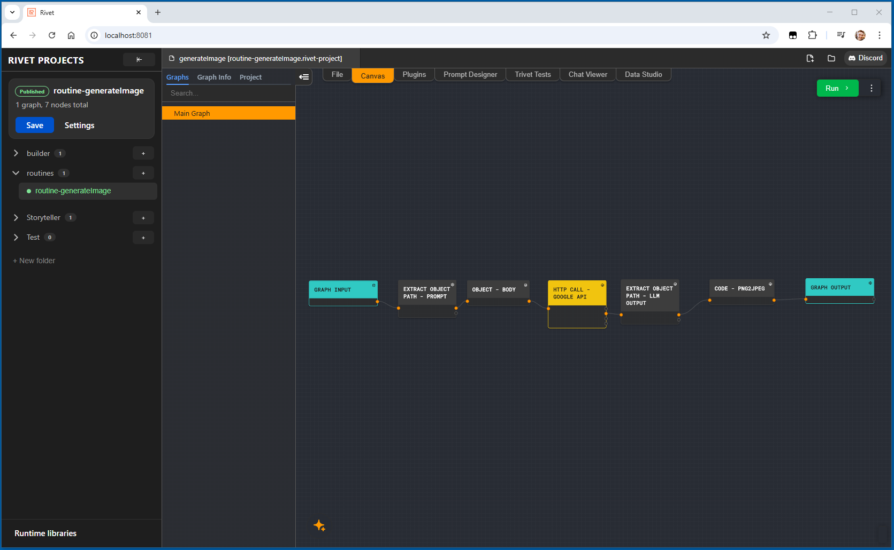

# Rivet Studio Server

Rivet Studio Server is the self-hosted browser editor and workflow-serving
platform that lives inside the Rivet monorepo. It provides:

- the Rivet editor in a browser
- folder and project management
- one-click workflow endpoint publication
- run recordings and replay
- the latest-workflow remote debugger
- runtime-library management for Code nodes
- UI, web-app, and workflow-endpoint access controls



## Documentation

- [Architecture](../../developer-docs/studio-server/architecture.md)
- [Access and routing](../../developer-docs/studio-server/access-and-routing.md)
- [Development](../../developer-docs/studio-server/development.md)
- [Kubernetes](../../developer-docs/studio-server/kubernetes.md)
- [Repository structure](../../developer-docs/studio-server/repo-structure.md)
- [Monorepo migration](../../developer-docs/studio-server/monorepo-migration.md)
- [Editor bridge](../../developer-docs/studio-server/editor-bridge.md)
- [Workflow publication](../../developer-docs/studio-server/workflow-publication.md)
- [Runtime libraries](../../developer-docs/studio-server/runtime-libraries.md)
- [Deployment status](../../developer-docs/studio-server/deployment-status.md)

## Monorepo Map

- `packages/studio-server-api/`: control-plane and execution-plane API
- `packages/studio-server-web/`: dashboard, hosted editor, and browser tests
- `packages/studio-server-executor/`: Node executor service
- `packages/studio-server-shared/`: browser/server contracts
- `packages/studio-server-bootstrap/`: API and executor process bootstrap
- `deploy/studio-server/images/`: production image definitions
- `deploy/studio-server/compose/`: Docker Compose stacks and proxy config
- `deploy/studio-server/helm/`: Kubernetes chart and overlays
- `deploy/studio-server/scripts/`: launchers and deployment verification
- `developer-docs/studio-server/`: architecture, operator, and contributor docs

All Rivet and Studio Server packages use the root Yarn workspace and one root
lockfile. There is no nested Rivet checkout, source clone step, package-link
overlay, or second dependency installation.

## Prerequisites

- Node.js 24+
- Corepack/Yarn using the release pinned by this repository
- Docker and Docker Compose for containerized development or deployment
- Git

Install the complete monorepo from the repository root:

```bash
corepack enable
yarn install --immutable
```

The former standalone npm command surface is retired. Update existing VM
automation as follows; no compatibility aliases are provided:

| Former command        | Monorepo command                                   |
| --------------------- | -------------------------------------------------- |
| `npm install`         | `corepack enable`, then `yarn install --immutable` |
| `npm run prod`        | `yarn studio-server:prod`                          |
| `npm run prod:custom` | `yarn studio-server:prod:custom`                   |

`yarn dev` remains the Rivet desktop/editor development command. Studio Server
development and deployment always use the `studio-server:*` namespace.

## Production Docker

Create `.env` from `deploy/studio-server/.env.example`.
The template contains only the starting settings for a single-host deployment.
The Docker launchers and Compose set internal service defaults; configure
storage, endpoint access, and other runtime policy in App Settings. Use the
dedicated Kubernetes template and operator guidance for cluster rehearsals.
Then run:

```bash
yarn studio-server:prod
```

This pulls the published
`ghcr.io/valerypopoff/rivet2.0-studio-server/*` images, recreates the
stack, and waits for it to become healthy. These are new, monorepo-owned packages; the retired `cloud-hosted-rivet2-wrapper/*` packages are not updated by this repository. The default browser URL is
`http://localhost:8080`; set `RIVET_PORT` to change it.

The production launcher detects the one existing historical Studio Server
app-data volume—either `compose_rivet_data` or `ops_rivet_data`—and uses the
matching Compose project so an in-place upgrade retains server settings and
filesystem-backed SQLite state. `compose` is the fresh-install default. If both
legacy volumes exist, set `RIVET_STUDIO_SERVER_COMPOSE_PROJECT` in `.env` to the
project that owns the production data; the launcher otherwise refuses the
ambiguous startup. When the managed-storage profile is enabled, the matching
PostgreSQL and object-storage volumes are reused too. Preserve the same `.env`
and make sure
`RIVET_ARTIFACTS_HOST_PATH` resolves to the same absolute host folder before
starting the monorepo checkout. Never use `docker compose down -v`, remove
these volumes, or run a volume prune during the cutover.

### Single-VM HTTPS

For a production VM, the Compose `proxy` container can terminate TLS and route
traffic itself. No nginx site configuration or nginx service is required on the
host after a successful cutover; the proxy **inside Docker** is still nginx.
Provide public and internal DNS names plus an existing certificate and key in
the root `.env`:

```dotenv
RIVET_PROXY_PUBLIC_HOST=rivet.example.com
RIVET_PROXY_INTERNAL_HOST=rivet-1.internal.example.com
RIVET_PROXY_TLS_CERT_HOST_PATH=/absolute/path/to/cert.pem
RIVET_PROXY_TLS_KEY_HOST_PATH=/absolute/path/to/key.pem
RIVET_PORT=80
RIVET_HTTPS_PORT=443
```

Replace the template's `RIVET_PORT=8080` line instead of adding a second
`RIVET_PORT` entry. The paths are on the VM and are mounted read-only into the
proxy container. The private key must be readable by its UID/GID 10001 without
being world-readable. Check this **inside a temporary proxy container** before
cutting over: a host ACL that looks correct may not survive the Docker bind
mount. A restricted `root:10001` key with mode `0640` is an option only if
host group 10001 has no unrelated members. Recheck access after certificate
renewal and recreate the proxy so it loads the new files.

The launcher validates the four TLS settings, enables the VM TLS Compose
overlay, and publishes host ports 80 and 443. Public HTTP redirects to HTTPS;
the internal hostname remains HTTP. Make DNS and firewall rules ready, render
`yarn studio-server:prod:config`, and confirm the ports can be handed over.
If host nginx currently owns them, preflight the container first, then stop
host nginx and run `yarn studio-server:prod`. Verify that the Compose proxy is
healthy and that direct-origin HTTP redirects and HTTPS serves the editor,
before disabling the old host service at boot. Keep its configuration for a
controlled rollback until the deployment is proven. The internal hostname is
**not** an access boundary by itself: restrict origin access at the VM/network
layer before relying on it as private. See the
[VM cutover details](../../developer-docs/studio-server/development.md#single-vm-https-without-host-nginx)
and [deferred private-host isolation work](../../developer-docs/studio-server/access-and-routing.md#future-work-enforce-private-host-isolation-on-a-single-vm).

For a direct-origin check after startup, substitute your public hostname and
run these on the VM. The HTTP response should be a `301` redirect to HTTPS;
the HTTPS response should serve Rivet without bypassing certificate checks:

```bash
curl --noproxy '*' --resolve rivet.example.com:80:127.0.0.1 -I http://rivet.example.com/
curl --noproxy '*' --resolve rivet.example.com:443:127.0.0.1 -I https://rivet.example.com/
```

These checks do not prove that the private hostname is isolated or that
Cloudflare/DNS traffic reaches the intended origin. Verify those separately,
along with your UI gate and published-route access policy, before public use.

Without these four TLS settings, production Compose keeps its original HTTP
listener, on port 8080 by default. Kubernetes uses a separate, external
gateway for hostname, TLS, auth, and route handling; it does not use this VM
TLS overlay.

Production Compose bounds disposable scratch: proxy `/tmp` is a 512 MiB tmpfs;
web `/tmp` and `/var/tmp` are 128 MiB each; the combined backend gets separate
512 MiB mounts at `/tmp` and `/var/tmp`; the one-shot artifact initializer has
128 MiB scratch mounts and a read-only root. They use RAM only as files are
written, and restart clears them. Workflows, recordings, settings, and runtime
libraries stay on their existing persistent mounts. If package installation or a
workflow needs more temporary space, set `RIVET_API_TMPFS_SIZE` and/or
`RIVET_API_VAR_TMPFS_SIZE` in `.env` after checking the VM memory budget, then
recreate the backend. A full scratch mount causes a visible write failure for
these standard temp paths. The graph-capable backend root is still writable,
so this is not a blanket disk-write prohibition for arbitrary workflow code.

Project dependency exports use a separate private **disk-backed** named volume,
`rivet_project_bundles`, mounted at `/data/project-bundles` in both production
and development Compose. No `.env` setting is required. Export accounting retains
the 2 GiB scratch budget and a 32 MiB free-space reserve; optional
`RIVET_PROJECT_BUNDLE_MAX_BYTES` / `RIVET_PROJECT_BUNDLE_SCRATCH_MAX_BYTES` tune
payload and scratch budgets, not the underlying disk size.
`RIVET_PROJECT_BUNDLE_FREE_SPACE_RESERVE_BYTES` tunes reserve headroom (1 MiB to
1 GiB). Files feed directly into the ZIP without raw staging; accounting follows
actual compressed output and retained archives, not preallocated limits. Finished exports expire
after 24 hours and cleanup protects active downloads. Keep ordinary tmpfs sizes
unchanged: disk-backed exports avoid competing with workflow memory in tmpfs.
Update the Compose files as well as the images, then recreate the stack through
the normal launcher so the initializer creates and owns the new volume. Updating
only an image does not install the mount. See the
[bundle deployment checks](../../developer-docs/studio-server/project-bundles.md#deployment-scratch-capacity).

Useful variants:

| Command                           | Behavior                                                                                                                                                                    |
| --------------------------------- | --------------------------------------------------------------------------------------------------------------------------------------------------------------------------- |
| `yarn studio-server:prod`         | Pull and run the published images                                                                                                                                           |
| `yarn studio-server:staging`      | On a clean staging checkout with an existing API container, verify matching staging images and all existing data mounts, then run digest-pinned images in the same VM stack |
| `yarn studio-server:prod:restart` | Recreate containers from already-local images after an environment-only change                                                                                              |
| `yarn studio-server:prod:custom`  | Build production images from the current monorepo commit and run them                                                                                                       |
| `yarn studio-server:clean`        | Show a host-wide Docker cleanup preflight, then require explicit authorization before pruning non-volume resources                                                          |

`yarn studio-server:clean` is a recovery tool for the whole selected Docker host, not only this Compose project. Start with:

```bash
yarn studio-server:clean -- --dry-run
```

The normal command prints the Docker context, endpoint, concise disk summary, and counted resource inventories (the first 20 rows of each); Docker decides which unused networks and images are eligible only at prune time. An interactive terminal then requires the exact `PRUNE` confirmation. Automation must pass `--confirm-host-prune`. It refuses a remote Docker endpoint unless both `--allow-remote-docker-host` and `--confirm-host-prune` are present. It preserves Docker volumes and bind-mounted workflow/recording paths, but it can remove stopped containers and their logs, unused images, unused custom networks, and builder cache belonging to any project on that Docker host.

For direct diagnostics:

```bash
# Replace <project> with the project printed by the production launcher.
# A fresh installation uses compose; a migrated installation can use ops.
docker compose -p <project> --env-file .env -f deploy/studio-server/compose/docker-compose.managed-services.yml -f deploy/studio-server/compose/docker-compose.yml ps
docker compose -p <project> --env-file .env -f deploy/studio-server/compose/docker-compose.managed-services.yml -f deploy/studio-server/compose/docker-compose.yml logs -f --tail=120 proxy web api
```

If an anonymous pull from public GHCR packages returns `denied`, clear stale
credentials with `docker logout ghcr.io` and retry. Pin a release with
`RIVET_IMAGE_TAG`, or override an individual image with `RIVET_PROXY_IMAGE`,
`RIVET_WEB_IMAGE`, or `RIVET_API_IMAGE`. Production runs the API and executor
processes inside the API image; the standalone executor image is retained for
predecessor rollback and explicit standalone use, not pulled by the production launcher.

For a staging VM trial, first confirm that the staging commit's **Build Images**
workflow succeeded, then use `yarn studio-server:staging` from that clean branch.
It resolves all staging aliases to matching commit-labelled immutable digests
and checks the rendered artifact bind mounts and named data volumes against the existing API container
before recreating anything. It uses the same data volumes and does not migrate
storage or change `.env`. See the [staging VM procedure](../../developer-docs/studio-server/development.md#deploying-a-verified-staging-build-to-a-vm).

## Development

Fresh single-host Compose installations initialize SQLite automatically before
serving: metadata, default App Settings and operational stores use SQLite, while
large project/dataset/recording/library payloads use checksum-addressed files.
There is no upgrade tab or reminder on fresh/completed SQLite installations.
Any retained entry in the four source roots keeps the explicit legacy workflow;
empty projects alone are not evidence of a new installation. Preserve all data
and control volumes from first start. Interrupted initialization retries its
owned identity and never launches a legacy fallback.

For existing file-backed single-host installations, the updated Compose stack offers **Settings → Local storage upgrade** as a browser-guided migration: prepare the server if prompted, pause and create a verified backup, download the archive, copy/verify, activate and validate while paused, then explicitly resume writes. New local settings are plaintext, including credentials: protect volumes and backups. The supported launcher requires none of `RIVET_LOCAL_METADATA_UPGRADE_ENABLED`, `RIVET_LOCAL_METADATA_CONTROL_ROOT` or `RIVET_LOCAL_METADATA_ENCRYPTION_KEY` in user `.env`. Older manual encrypted databases still need their original key until live plaintext conversion completes; custom roots need one boot with their original root to retain its binding. The supervisor performs the necessary API/executor restarts; web/proxy are not restarted. Preserve the reserved `rivet_local_metadata` volume and the App Data installation binding. A lost/corrupt volume or a custom unsupported launcher still requires administrator recovery; the UI must never initialize a replacement over an existing migration. See the [local upgrade runbook](../../developer-docs/studio-server/local-metadata-upgrade.md).

The Docker development stack is the default production-shaped loop:

```bash
yarn studio-server:dev
```

For development from another computer through a VS Code tunnel, use:

```bash
yarn studio-server:dev:tunnel
```

Forward the same proxy port shown by the launcher (for example, 8081), then open
the authenticated tunnel URL. Do not forward the private API or frontend ports.
Keep tunnel sign-in and Rivet's UI access controls enabled.

This mode bundles frontend edits automatically and keeps the normal backend
watchers. The first launch waits for a complete bundle; subsequent full rebuilds
currently take roughly two minutes and need substantial Docker memory (measured
around 5.3 GiB for the builder alone). It is not intended to build on a small
production VM. Successful updates refresh a clean, idle workspace. With unsaved
edits or active work, the app offers **Refresh when safe** instead; save changes
and finish runs before using it. A failed build keeps the last working frontend
available; inspect `yarn studio-server:dev:docker:logs` for details.

Run `yarn studio-server:dev` to return to Vite hot reload. These commands are
alternative modes of the same stack and use the same data mounts. Save browser
edits before deliberately switching modes. Neither command migrates storage.
See [tunnel development](../../developer-docs/studio-server/development.md#tunnel-friendly-development)
for cache limits, troubleshooting and verification commands.

If a loading failure shows **Retry loading**, first check your connection and
tunnel sign-in, and wait for any build to finish. Retry reloads the failed page
or editor iframe; it does not reset saved projects or browser recovery data.

Development runs API and executor source watchers in one backend container,
matching the production Compose container layout while retaining hot reload.
When Compose recreates the backend, it also restarts Nginx. Frontend mode changes
do not restart Nginx or disconnect executor sessions: the dev launcher gracefully
reloads its configuration after frontend readiness, refreshing Docker service-name
resolution without retiring existing connections. If you recreate only `web`
using Compose directly, run `docker compose ... exec -T proxy nginx -s reload`
after it becomes ready, or use the normal dev launcher to do this safely.

Useful commands:

```bash
yarn studio-server:dev:docker:ps
yarn studio-server:dev:docker:logs
yarn studio-server:dev:docker:down
```

For direct host processes, use `yarn studio-server:dev:local`. The direct mode
is useful for process-level work but does not reproduce nginx trusted-proxy
routing. See the development guide for focused workspace and Playwright
commands.

## Kubernetes Shape

The supported topology separates low-volume editor traffic from high-volume
published workflow traffic. The production chart defaults to an external
gateway supplied by the cluster operator; the `proxy` tier below belongs only
to its embedded compatibility mode:

- `proxy`: scalable ingress tier in embedded compatibility mode
- `execution`: scalable published-workflow tier
- `web`: one replica by default for the small editor audience
- `backend`: one replica for control-plane APIs, latest execution, and the
  process-local latest debugger

The chart sets explicit replica, HPA, resource, and PostgreSQL pool budgets so
scaling execution traffic does not multiply database connections without a
corresponding capacity decision. See the Kubernetes guide for overlays,
release gates, and production handoff.

## Runtime Shape

```text
Browser -> nginx (Rivet proxy in Compose/embedded mode)
           |- / -> web
           |- /api/* -> control-plane api
           |- /workflows/* -> execution-plane api
           |- /workflows-latest/* -> control-plane api
           |- /ws/latest-debugger -> control-plane api
           `- /ws/executor* -> executor
```

In production Kubernetes external-gateway mode, the cluster operator's gateway
performs this routing instead of the Docker/embedded nginx proxy.

The API consumes `@valerypopoff/rivet2-core`, `@valerypopoff/rivet2-node`, and
the other Rivet packages through normal `workspace:^` dependencies. Image
builds copy the required monorepo packages from one Git commit and one build
context.

## Security

- filesystem access is restricted to configured roots
- environment-variable access is allowlist-only
- shell commands are allowlist-only
- path traversal is rejected on path parameters
- workflow endpoint bearer authentication is enabled by default

Set `RIVET_KEY` to the shared secret. Use Studio settings to configure workflow
endpoint access control and exact trusted hosts. Set
`RIVET_REQUIRE_UI_GATE_KEY=true` to protect the browser UI and related
websockets with the key gate.
