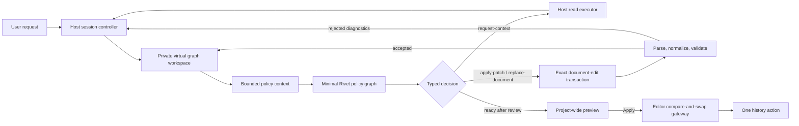

# Graph Builder Process Reassessment and Virtual-Workspace Implementation

## Scope and confidence

This report records:

- the verified pre-redesign Graph Creator baseline;
- the weaknesses that motivated the redesign;
- the implemented transactional virtual-workspace architecture;
- the remaining rollout and capability limits.

The historical analysis covers the Sparkles/Generate UI path,
`useAiGraphBuilder`, the bundled `graph-creator.rivet-project`, the former
`graph-creator.rivet-data` bundle, the AI Assist adapter, host mutation helpers,
and their focused checks. Historical measurements refer to commit `471e76af`.

The current architecture statements are grounded in the repository-owned
Graph Builder domain, virtual workspace, policy runner, session controller,
authoring semantics, editor gateway, UI, and tests. Quality, latency, and cost
improvements remain hypotheses until representative credentialed evaluations
and the declared dogfood gates have run.

## Executive conclusion

The legacy Graph Creator had one strong principle:

> Host code, not the model, owns the live editor graph and the final mutation.

Its implementation around that principle was outdated. It used a long
one-tool-per-round loop, extra model calls for deterministic name resolution
and brainstorming, repository-relative discovery, incremental publication,
repeated full-graph layout, growing conversation context, and an implicit
completion sentinel.

The transactional Graph Builder preserves host authority but gives a current
frontier model a thinner and more expressive authoring surface:

> The host creates a private, revisioned set of full-fidelity YAML graph
> documents. The model reads exact bounded document text and normally proposes
> standard unified diffs, with a bounded complete-document replacement for
> unusually fragile rewrites. The host parses, normalizes, validates, previews,
> and atomically publishes the accepted project draft only after explicit
> Apply.

This is intentionally not direct `.rivet-project` editing. The model never sees
or writes a project file, never receives a filesystem handle, and never owns
commit. The YAML is a model-facing, in-memory `NodeGraph` representation with
host-owned paths, revisions, secret placeholders, validation, and history
semantics.

## Implementation status

The repository now contains:

- a bounded, typed policy protocol with `request-context`, `apply-patch`,
  `replace-document`, `ready`, `no-change`, `clarify`, and
  `cannot-complete`;
- one private virtual YAML document for every existing project graph;
- exact revision-bound unified-diff application with no fuzzy fallback;
- full portable node data in the virtual document, including code, prompts,
  schemas, and plugin-owned fields;
- stable host-owned placeholders for stored secret-like values;
- bounded active-document context and line-window document reads;
- registry-backed node search and complete node templates;
- project-aware normalization and validation;
- mandatory post-edit review before preview;
- cumulative multi-graph preview and one atomic Apply/undo/redo action;
- conflict, cancellation, clarification, replay, budget, and accounting
  guards;
- a separately selectable, hardened legacy rollback implementation.

The implementation selector remains a rollout control. A session latches one
mode at start and never dual-runs or switches implementations in flight. The
legacy path stays available until the frozen evaluation, hidden-holdout,
credentialed comparison, and dogfood gates are satisfied.

Multi-graph editing is no longer a future “Phase 8” concept. A session may
apply sequential single-document diffs to several existing graphs and publish
the resulting project draft as one history action. Creating, deleting, or
renaming graph documents and editing project-level resources remain outside
the current scope.

## Pre-redesign legacy execution process

Before the transactional redesign and legacy rollback hardening, clicking
Generate followed this path:

1. The UI resolved the selected AI Assist provider and model.
2. `useAiGraphBuilder` cloned the displayed graph.
3. It deserialized the bundled Graph Creator project and datasets.
4. It registered external functions for creating, editing, connecting,
   deleting, inspecting, and reviewing nodes.
5. It ran the bundled project's `Main` graph with the request, the complete
   current graph as formatted JSON, and the selected model.
6. `Main` invoked a `Loop Until` with a 50-iteration maximum.
7. Each `Loop` iteration built the accumulated prompt, called the model with 16
   tools, delegated at most one tool call, and appended its result.
8. Mutating host functions immediately published the working graph.
9. `finished` raised a final-message event and returned
   `COMPLETELY_FINISHED_VALUE`, which ended the loop.
10. The host ignored graph outputs, captured aggregate cost, and treated
    non-aborted processor completion as success.

The relevant historical seams were:

- `packages/app/src/hooks/useAiGraphBuilder.ts`
- `packages/app/src/hooks/aiGraphBuilderHelpers.ts`
- `packages/app/src/utils/aiAssistVercelGenerator.ts`
- `packages/app/graphs/graph-creator.rivet-project`

## Pre-redesign measured baseline

At commit `471e76af`:

| Component               |           Value |
| ----------------------- | --------------: |
| Graphs                  |              24 |
| Nodes                   |             193 |
| Connections             |             193 |
| Exposed model tools     |              16 |
| Delegate handlers       |              17 |
| Embedded LLM-call nodes |               6 |
| External Call nodes     |              12 |
| Workflow file           |    93,856 bytes |
| Node knowledge dataset  | 1,184,114 bytes |
| Main loop limit         |   50 iterations |

The seventeenth delegate handler, `addNodeData`, was dormant because it was not
in the model tool list.

The knowledge dataset contained:

| Dataset            | Rows | Approximate serialized size |
| ------------------ | ---: | --------------------------: |
| Node Summaries     |  100 |                      64 KiB |
| Node Source Code   |  108 |                     594 KiB |
| Node Documentation |  101 |                     525 KiB |

The complete 1.18 MB dataset was bundled and deserialized per invocation, but
was not sent wholesale on every provider call. `brainstorm` sent all summaries;
documentation and source handlers sent selected full rows after an extra
model-based filename lookup. Individual rows reached roughly 40 KB.

## Historical strengths

### 1. The model did not replace the project file

The legacy model requested bounded host operations. The host created actual
nodes and connections and generated IDs. This was safer than accepting an
unvalidated model-authored project serialization.

The current architecture preserves the important part of this principle. A
model-authored virtual YAML diff is only a proposal against private canonical
text; it cannot become a project until host parsing, normalization, semantic
validation, preview, and Apply all succeed.

### 2. Node creation used the live registry

Legacy ordinary-node creation resolved labels through the project node
registry and used registered defaults. This was stronger than a fixed enum,
although it did not cover every project-specific Add Node choice, referenced
graph alias, or node-library prefab.

The current authoring catalog and `get-node-templates` read preserve
registry-backed construction without forcing the model through a custom
setting adapter for every node field.

### 3. Connections received structural checks

Legacy helpers checked node existence, port existence, and duplicate incoming
connections before adding a wire. They did not fully match editor semantics:
project context, built-in conditional inputs, complete incident connections,
coercion, and async topology were incomplete.

The current candidate validator uses the complete authoring project and shared
editor/runtime rules.

### 4. The process was observable

The legacy UI exposed progress, external calls, errors, cancellation, cost, and
incremental changes. That made failures diagnosable even though intermediate
changes were authoritative.

The current implementation keeps bounded progress and accounting while
replacing incremental publication with a private preview.

### 5. Documentation and source were available as recovery paths

This was useful for unfamiliar nodes, but expensive and repository-dependent.
The current normal path uses registry-backed search, complete templates, and
bounded document reads. Source remains a developer diagnostic, not routine
model context.

### 6. The unused legacy knowledge bundle was retired

`graph-creator.rivet-data` was a generated source, documentation, and summary
bundle. Neither the hardened rollback nor transactional path loaded it at
runtime, so its freshness check only created avoidable CI churn after unrelated
node documentation changes. The bundle is retired. The rollback boundary is
now checked by `check-legacy-graph-creator-rollback.mjs`; the transactional path
continues to use its smaller checked policy and catalog assets.

### 7. The workflow dogfooded Rivet

The orchestration being a Rivet project made it inspectable and exercised the
runtime. The current design keeps a minimal checked Rivet policy project for
the provider call, while deterministic TypeScript owns transactions,
validation, editor state, and commit.

## Historical weaknesses and their disposition

### 1. One-tool-per-round orchestration

The legacy adapter disabled parallel tool calls and retained only the first
call. Complex changes consumed many rounds and could approach the 50-iteration
limit.

**Current disposition:** one `apply-patch` decision may make a coherent set of
changes within one graph document. Independent read requests may be batched.
Large work may use several coherent diffs without representing every node
operation as a separate policy call.

### 2. Model calls used as name resolvers

`createNode`, `readNodeDocumentation`, and `readNodeSourceCode` called another
model before deterministic lookup.

**Current disposition:** `search-node-types` and `get-node-templates` use the
captured authoring catalog directly.

### 3. `brainstorm` duplicated the main agent

It sent all node summaries, all functions, help, and the task to another model,
then fed the answer back to the primary loop.

**Current disposition:** removed from the transactional path. The main policy
model requests only specific host context.

### 4. Every mutation changed the live graph

Legacy mutations repeatedly laid out and published the entire graph, cleared
history, moved the viewport, and left partial work after cancellation or
failure.

**Current disposition:** all edits remain in a private project draft. Apply is
one compare-and-swap publication and one undoable command.

### 5. Project-aware port evaluation was wrong

The bundled helper project was passed where the user's project was required.
Built-in conditional inputs and complete incident connections were omitted.

**Current disposition:** authoring semantics receive the complete captured
project, live active-graph overlay, registry, references, effective prefab
nodes, and shared port helpers.

### 6. The boundary was structural, not setting-safe

Legacy `editNode` accepted arbitrary values for existing top-level keys and
bypassed normal reconciliation and graph-boundary propagation.

**Current disposition:** full-fidelity YAML deliberately permits portable node
data, but it is never trusted directly. The host verifies the document shape,
restores secrets, normalizes deterministic graph-local presentation, and
validates the complete candidate before promotion. Boundary changes require
explicit edits to affected callers; they are not silently propagated.

### 7. Lint was incomplete and independent

Legacy lint had useful missing-node/port and island checks but did not model all
editor/runtime constraints or provide stable diagnostic identity.

**Current disposition:** host-authored diagnostics use stable rule and
diagnostic keys, severities, verification state, blocking keys, and explicit
completeness. Preview is impossible when validation is incomplete or blocking.

### 8. Full graph JSON increased tokens and secret exposure

The entire graph entered the first model message, including unrelated code,
prompts, and potentially credentials.

**Current disposition:** the active virtual document is bounded; other text is
read by line window or exact `nextOffset` continuation when one logical line
exceeds the byte window. Stored secret-like fields become immutable
placeholders. The system prompt treats all graph content as untrusted data.

Full fidelity means relevant code and prompts can still be sent to the selected
provider. The feature is an authoring assistant, not a local-only editor.
Users should not place unrelated sensitive prose in model-visible node fields.

### 9. Conversation context grew without a canonical state view

The model accumulated many local tool results and occasionally received
another full graph review.

**Current disposition:** every policy turn carries the current revision,
canonical active-document window, document index, project delta, diagnostics,
and a bounded transcript. Accepted patches rebuild canonical documents.

### 10. Discovery depended on the source checkout

The loop read `packages/core/src/model/nodes`, which could be absent in packaged
apps and did not represent installed plugins or project-specific choices.

**Current disposition:** discovery uses the live immutable authoring catalog.

### 11. Prompts encouraged unnecessary work

The legacy prompt asked for frequent brainstorming, source/documentation
reads, planning/status calls, and text reasoning while also requiring a tool
call on every round.

**Current disposition:** the policy prompt is principle-level and protocol
focused. It asks for context only when needed, direct diffs when evidence is
available, and a separate completeness review after each accepted edit.

### 12. Tool contracts were duplicated and drifted

Workflow schemas, delegate mappings, handler inputs/outputs, and host argument
parsing were manually synchronized. Descriptions disagreed with runtime
results.

**Current disposition:** one local schema owns decisions and reads. The policy
asset and manifest are generated/freshness-checked. Host results are parsed
again at every trust boundary.

### 13. Serialized model settings were misleading

Legacy helper-node model/sampling fields did not always control the actual AI
Assist request.

**Current disposition:** the policy runner captures and fingerprints the
selected provider/model configuration and injects only the sealed allowlist
into one designated policy node.

### 14. Completion used an implicit sentinel

Loop exhaustion could look successful even when `finished` was never called.

**Current disposition:** terminal decisions and controller states are explicit.
Only `ready` after an accepted edit can enter preview; only Apply can commit.

### 15. Only the current graph could change

Legacy operation tools could not refactor dependent graphs atomically.

**Current disposition:** all existing graph documents are in one private
workspace. Separate exact diffs may update several graphs, and one cumulative
project draft is validated, previewed, committed, undone, and redone.

### 16. End-to-end quality was not measured

Focused implementation tests did not establish quality, provider-call count,
tokens, latency, cost, readability, or correction rate on representative
tasks.

**Current disposition:** the repository has provider-neutral accounting and
evaluation adapters, but the rollout claims remain gated on actual frozen and
credentialed results. The redesign must not be declared cheaper or more
accurate solely from architecture.

## Implemented target architecture

### Ownership diagram



The policy graph performs only the provider call. It has no filesystem, native
API, plugins, external calls, datasets, MCP, code runner, project references,
editor cache, Stored Value store, Knowledge Store registry, or commit callback.

### Virtual document contract

Each captured existing graph maps to:

```text
graphs/<percent-encoded-graph-id>.yaml
```

The document is deterministic and data-only:

```yaml
version: 1
graph:
  metadata: ...
  nodes: ...
  connections: ...
```

The complete `NodeGraph` is represented. This is the essential simplification:
the model can inspect and edit code, prompts, schemas, dynamic node data,
connections, and visual metadata without the host maintaining a parallel
setting DSL.

The document is not a `.rivet-project` file. Project metadata, project data,
UI graphs, node-library definitions, plugin installation/configuration,
knowledge stores, MCP servers, referenced projects, and filesystem paths are
not writable through this surface.

### Workspace context and reads

Every turn includes:

- protocol, policy, session, turn, and attempt identity;
- user request and phase;
- current draft revision;
- compact graph projection and cumulative delta;
- document index with path, graph ID, name, digest, UTF-16 length, lines, and
  access;
- bounded beginning of the active document;
- correlated transcript, context results, diagnostics, and remaining budgets.

Supported current reads are:

- `search-node-types`
- `read-virtual-document`
- `get-node-templates`
- `get-diagnostics`
- `list-project-resources`

Legacy/internal schemas such as `get-node-specs`, `inspect-draft`, and
operation-based patches may remain for rollback compatibility. They are not
the recommended policy authoring surface.

### Decision contract

```ts
type GraphBuilderDecision =
  | { type: 'request-context'; requests: GraphBuilderReadRequest[] }
  | {
      type: 'apply-patch';
      baseRevision: number;
      unifiedDiff: string;
      summary?: string;
    }
  | {
      type: 'replace-document';
      baseRevision: number;
      path: string;
      content: string;
      summary?: string;
    }
  | { type: 'ready'; summary: string }
  | { type: 'no-change'; summary: string }
  | { type: 'clarify'; question: string }
  | {
      type: 'cannot-complete';
      reasonCode: 'unsupported-capability' | 'insufficient-context' | 'unsafe-request' | 'request-conflict' | 'other';
      reason: string;
    };
```

The provider returns one exact JSON object. The host parses it with the local
schema even if a provider supports structured output. Model-authored IDs,
summaries, and reasons are bounded. Host correlation and accounting fields are
never accepted from model output.

### Document-edit transaction

An `apply-patch` decision targets exactly one known virtual path. It must use:

- matching `---` / `+++` headers;
- one or more valid `@@` hunks;
- exact line counts and exact current context;
- the current draft revision;
- no timestamps, absolute paths, traversal, fuzzy matching, or extra files.

`replace-document` is the bounded fallback for a rewrite where an exact diff
would be unusually large or fragile. It carries one known path and the complete
canonical YAML document. Policy may choose it only after reading the complete
current document; it must not reconstruct a whole file from a truncated
window. Replacement does not bypass any parse, secret, normalization,
validation, review, preview, or Apply gate.

The controller verifies complete visibility with a private current-revision
coverage ledger keyed by normalized path, document digest, and total UTF-16
length. The active inline window and successful read bodies actually retained
for delivery to the model add exact offset intervals. Coverage may accumulate
across policy turns and survives transcript compaction; compacted summaries
neither grant nor revoke authority. Failed reads and full read bodies replaced
by turn-size budget errors never count. Any accepted edit advances the draft
revision and resets coverage against the new canonical documents. A
replacement is authorized only when the exact current path/digest entry covers
the gap-free interval `[0, totalLength)`.

The host:

1. checks patch identity and revision;
2. parses and applies the diff, or accepts the complete replacement text;
3. parses strict YAML 1.2 with aliases disabled;
4. verifies one bounded envelope and complete graph shape;
5. restores unmodified secret placeholders;
6. inserts the graph into a cloned private project;
7. performs deterministic graph-local normalization;
8. derives the attempted project delta;
9. validates every affected graph;
10. promotes the complete candidate or retains nothing.

Applied patches advance revision once. Rejected and no-op patches retain the
revision. Idempotent replay returns the original result only when patch
identity and content match.

### Secret contract

Non-empty values under secret-like field names become stable host-owned
placeholder objects. The model may preserve them or delete the owning node. It
may not inspect, move, replace, remove independently, or create secret-like
values. The host restores originals only after the edited document passes the
placeholder checks.

This heuristic is defense in depth. Plugin-defined secret storage with unusual
names requires an explicit reviewed classifier/adapter. User request text is
provider-bound and can contain whatever the user typed.

String-valued API-key lookup policy is exempt only through the reviewed exact
field allowlist: `apiKeyEnvVarName`, `apiKeyProgrammaticName`, `apiKeySource`,
`customProviderApiKeyEnvVarName`, and
`customProviderApiKeyProgrammaticName` after key normalization. Arbitrary
fields ending in `Source` or `EnvVarName` are not exempt. Boolean
`use...Input` policy switches remain editable, while null and empty values are
inert.

### Node creation and unfamiliar nodes

The model does not invent raw node structures from documentation. It searches
the live catalog and asks for one or more complete templates. A template is
created through the same registry-backed authoring seam as the editor and
contains the portable node object plus relevant ports/specification context.

The model copies that object into the graph, replaces the template ID with a
unique graph-local ID, and changes task-required fields. Semantic validation
remains authoritative.

Direct document editing retains the existing Code security boundary. It cannot
create or expand Code runtime permissions, and it cannot rewrite source when
the captured base Code node has an enabled base or variant permission. Every
edit is checked against the captured base, so disabling a permission in one
private edit cannot be used to rewrite privileged source in a later edit before
Apply.

### Mandatory post-edit review

`apply-patch` and `replace-document` are always nonterminal. After any accepted
edit, the next phase is `reviewing`, and the policy receives the new canonical
revision.

The policy must compare the complete accepted draft with every requirement in
the original request. It may:

- read another document/window;
- apply another diff or complete-document replacement to the same or another
  graph;
- request clarification;
- truthfully stop as unsupported;
- emit `ready` only after all requested work is present.

This is the direct fix for the observed complex-task failure where the builder
changed only “stage 1” and nevertheless offered Apply.

### Multi-graph semantics

The workspace contains every existing graph, but one decision patches one
document. This prevents ambiguous multi-file diff parsing and gives precise
repair diagnostics.

A session may edit graph A, then graph B, then graph C. The preview is one
cumulative project delta, validation covers every graph the candidate actually
changed, and Apply publishes the whole draft in one history command. Existing
Graph Input/Output identities and data types stay immutable in persisted
graphs, while new boundary nodes may be added. Only a captured transient
canvas has a fully mutable initial boundary; the normalizer performs no hidden
caller rewrites.

Multi-graph does not currently mean:

- creating/deleting/renaming graph files;
- authoring project resources;
- allowing one diff to contain several file headers.

### Preview and commit

The preview contains bounded per-graph deltas, exact total counts, diagnostics,
draft revision, and a deterministic host summary. The React layer never owns a
mutable draft.

Apply rechecks:

- current editor eligibility;
- base project/editor/plugin/reference/policy identity;
- complete candidate validation;
- canonical prepared content;
- commit ID idempotency.

Success publishes all changed graphs once and records one undoable action.
Conflict, ineligibility, protocol error, or validation failure publishes
nothing and retains the private preview where appropriate.

The Graph Builder never writes a project YAML file. Persistence still happens
only through the normal editor save/autosave path after Apply.

### Cancellation and resource limits

The controller serializes mutations and bounds:

- provider attempts and repair attempts;
- wall-clock and active-work inactivity;
- clarification lifetime;
- policy-turn and transcript bytes;
- read, document, and diff sizes;
- input/output tokens and cost;
- diagnostics and delta detail.

The default active-work limits are 32 physical provider attempts, four
consecutive repair failures, 15 minutes of wall-clock work, and four minutes
without provider/read activity.

Reads can run concurrently when independent, but every result is correlated to
its request index and observed draft revision. Abort prevents late results from
advancing the session. Once synchronous commit publication starts, its result
wins over a later cancellation.

Streaming output refreshes the inactivity timer without extending the
wall-clock deadline. Repair limits apply to consecutive failures and reset
after a successfully applied edit, while total repair attempts remain
observable. Once a validated preview exists, active-work timers stop so human
review does not invalidate the draft; Apply still rechecks live identity and
commit eligibility. The newest read batch occupies `contextResults` only once
on the immediately following policy call and is omitted from that call's
transcript copy. Current-revision read bodies may return to transcript history
after that immediate slot is cleared, but an accepted edit immediately reduces
older-revision read bodies to digest records. Complete-document authorization
does not depend on transcript retention: the separate current-revision
path/digest/length interval ledger records only successful read bodies retained
for actual model delivery, survives transcript compaction, and resets after
every accepted edit.

## Implementation ownership

| Responsibility                                                         | Owning seam                                                  |
| ---------------------------------------------------------------------- | ------------------------------------------------------------ |
| Schemas, limits, deltas, diagnostics                                   | `packages/app/src/domain/graphBuilder`                       |
| Canonical graph YAML, diff/replacement application, secrets, revisions | `virtualGraphWorkspace.ts`                                   |
| Registry choices and safe templates                                    | `authoringCatalog.ts`                                        |
| Candidate normalization/validation                                     | `authoringSemantics.ts`                                      |
| Bounded reads                                                          | `readExecutor.ts`                                            |
| Policy prompt and provider call                                        | `policyPrompt.ts`, `policyRunner.ts`                         |
| Session lifecycle, budgets, review                                     | `sessionController.ts`                                       |
| Runtime composition                                                    | `planBSessionRuntime.ts`                                     |
| Editor snapshot, conflict identity, commit/history                     | `editorSnapshot.ts`, `identity.ts`, `editorGateway.ts`       |
| React ownership and modal                                              | `usePlanBGraphBuilder.ts`, `GraphBuilderSessionPanel.tsx`    |
| Rollback implementation                                                | `legacyDraftRunner.ts`, `legacyGraphCreatorAgentExecutor.ts` |

Dependencies must point inward toward model-free contracts. Domain code must
not import React, Jotai, provider SDKs, app state, credentials, or the editor.
The virtual workspace receives normalization and validation callbacks rather
than importing editor state.

## Implemented delivery sequence

### Phase 0: Baseline and contracts

- Captured the historical architecture and measurements.
- Added versioned decisions, reads, diagnostics, results, metrics, and
  provider-call accounting.
- Added deterministic, provider-free evaluation fixtures.

### Phase 1: Hardened legacy rollback

- Moved legacy mutation into a session-private project draft.
- Removed incremental editor publication from generation.
- Routed success through explicit preview and the shared commit gateway.
- Kept this implementation selectable as rollback rather than a third mixed
  path.

### Phase 2: Transaction and commit foundation

- Added base identity, stale-editor conflict detection, commit idempotency,
  private preview, and one history command.
- Preserved active-editor and related-graph state through Apply/undo/redo.

### Phase 3: Project-aware authoring semantics

- Captured the live registry, project choices, references, and preferences.
- Shared dynamic ports, connection compatibility, async topology, tool/loop,
  prefab, and boundary rules.
- Added deterministic normalization and stable diagnostics.

### Phase 4: Minimal policy runtime

- Added the checked Graph Builder policy project and manifest.
- Sealed its registry and capabilities.
- Added exact JSON parsing, usage observation, budgets, clarification,
  cancellation, and transcript compaction.

### Phase 5: Full-fidelity virtual workspace

- Replaced the model-facing operation DSL with canonical per-graph YAML.
- Added bounded line/cursor document reads backed by cached per-document line
  offsets, plus complete registry-backed templates.
- Added exact unified diffs, bounded complete-document replacement, secret
  placeholders, controller-owned current-revision coverage authorization,
  parsing, normalization, validation, and idempotent draft promotion.
- Kept legacy operation schemas only where rollback/internal compatibility
  still requires them.

### Phase 6: Multi-graph preview and publication

- Allowed sequential edits across all existing project graph documents.
- Derived project-wide deltas and validation.
- Published every changed graph through one Apply and one undo/redo action.

### Phase 7: Rollout validation

The code path exists, but rollout completion is operational:

- populate frozen as-shipped, hardened-legacy, and transactional baselines;
- bind and run protected hidden holdouts;
- run credentialed provider comparisons;
- measure complex graph rebuilds, including multi-stage and cross-graph work;
- complete the declared dogfood window;
- switch the default only when thresholds pass;
- remove rollback assets only in a later dedicated cleanup.

## Risk register

| Risk                                                    | Mitigation                                                                  | Residual limit                                                    |
| ------------------------------------------------------- | --------------------------------------------------------------------------- | ----------------------------------------------------------------- |
| Model emits malformed YAML                              | Strict one-document YAML 1.2 parse, data-only bounds, complete shape checks | Repair costs another turn                                         |
| Diff applies to stale/wrong text                        | Exact revision and context, no fuzzy application                            | Model must reread after rejection                                 |
| Model edits only part of a complex request              | Mandatory separate reviewing turn                                           | Quality still depends on model review                             |
| Stored credentials leak                                 | Secret-like placeholders and isolated policy credentials                    | Name heuristic cannot classify every plugin field                 |
| Graph text contains prompt injection                    | System protocol treats all embedded text as untrusted                       | Provider still sees authorized document content                   |
| Unknown node shape                                      | Registry-backed complete templates                                          | Template coverage follows registered authoring choices            |
| Candidate is structurally valid but semantically broken | Changed-graph validation against complete project context                   | Validation is only as complete as Rivet's extracted rules         |
| Multi-graph edit partially publishes                    | One private project draft and one editor history command                    | No cross-window/external-writer transaction                       |
| Huge graph exceeds policy context                       | Bounded inline window, cached cursor reads, and multi-turn coverage ledger  | More reads/turns may be required                                  |
| Patch output becomes token-heavy                        | Narrow coherent hunks, bounded diff size, and replacement only when safer   | Large rewrites still cost output tokens                           |
| Secret placeholder moved or synthesized                 | Exact semantic locator checks                                               | Deliberate owning-node deletion removes the secret with it        |
| Direct project-file corruption                          | No filesystem or `.rivet-project` write capability                          | Normal editor persistence remains outside the session transaction |
| Rollout regression                                      | Separate legacy rollback and latched mode                                   | Maintaining rollback temporarily costs code and tests             |

## Expected outcome hypotheses

The architecture should reduce:

- provider calls spent on single-node bookkeeping;
- nested name-resolution and brainstorming calls;
- duplicated setting-schema maintenance;
- context ambiguity after many local operations;
- partial live-editor mutations;
- complex-task failures caused by missing code/prompt/schema visibility.

It may increase:

- output tokens for large diffs;
- the importance of exact line-oriented patch quality;
- model-visible non-secret node data compared with the old compact
  allowlisted projection;
- implementation responsibility in candidate validation.

Therefore success criteria must be measured, not inferred:

- completion and first-pass-validity rate;
- semantic task coverage;
- repair turns;
- provider calls, input/output tokens, cost, and latency;
- graph readability and manual corrections;
- rollback/cancellation correctness;
- secret-placeholder and prompt-injection tests;
- multi-graph Apply/undo/redo correctness.

## Semantic compatibility and intentional differences

Preserved:

- the user enters a natural-language graph-building request;
- the selected AI Assist provider/model performs the reasoning;
- built-in and installed registry nodes are available;
- progress, cancellation, and diagnostics are visible;
- the result is a normal editable Rivet graph.

Intentional differences:

- no incremental authoritative publication;
- no one-tool-per-round mutation loop;
- no routine nested name-resolver or brainstorm models;
- no repository-relative source discovery;
- no model-facing custom operation DSL for ordinary graph authoring;
- no direct project serialization or disk write;
- explicit preview and Apply;
- one final history action;
- mandatory review after each accepted edit;
- existing multi-graph edits are transactional;
- project-level resource authoring remains unsupported.

## Final assessment

The right modernization is neither an unconstrained model-authored
`.rivet-project` nor a larger catalog of tiny mutation tools.

The implemented boundary is a thin virtual editing environment:

- full-fidelity enough for a frontier model to understand and rebuild complex
  graphs;
- exact and revisioned enough to repair deterministically;
- secret-aware and bounded enough for provider use;
- registry-aware enough to produce real Rivet nodes and valid connections;
- transactional enough that preview, Apply, conflict handling, and history
  remain trustworthy.

This lets the model “cook” inside a private native-shaped graph document while
the host retains every authority that matters.
