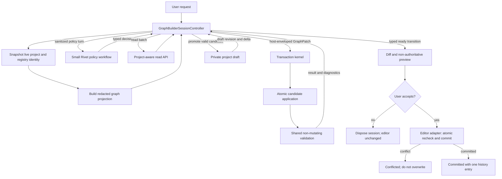

# Graph Builder Process Reassessment and Plan B Implementation

## Scope and confidence

This report records the verified legacy baseline, the sole Plan B target
architecture, and the current implementation status. Its legacy findings cover:

- The Sparkles/Generate UI path.
- `useAiGraphBuilder`.
- The bundled `graph-creator.rivet-project`.
- The bundled `graph-creator.rivet-data`.
- The AI Assist adapter used by the bundled workflow.
- The host-side graph mutation helpers.
- The focused tests and repository checks for this feature.

Structural findings in this report are confirmed against the code. Performance outcomes for Plan B are hypotheses until Rivet has a repeatable end-to-end evaluation suite. In particular, the targeted number of provider requests is a design goal, not a measured guarantee.

## Executive conclusion

The assessed legacy Graph Creator had a sound containment boundary but not a
comprehensive safety model:

> The model requests graph operations through controlled tools; host code owns the actual graph objects and node IDs.

That is the strongest part of the design and should remain.

The orchestration around that boundary was outdated. It assumed that the model
should make one small decision, call one tool, inspect the result, and repeat.
It also used additional LLM calls for name matching and brainstorming. This
produced unnecessary provider requests, repeated layout work, growing context,
and a fragile completion protocol.

This report adopts **Plan B** as the sole implementation architecture:

> The host owns the complete Graph Builder session and private project draft. A small Rivet policy workflow receives compact, project-aware context and returns one typed decision at a time. The host executes requested reads, applies validated patch proposals atomically, previews the accepted draft, and commits it once after explicit user approval.

A large or unfamiliar task may still need several retrieval and patch batches. Plan B supports a complete patch without requiring every task to fit into one response.

## Implementation status

The repository now contains the repository-owned Plan B runtime for the final
Phase 2 and Phase 4-6 architecture, the Phase 0 evaluation/accounting
infrastructure, the hardened Phase 1 rollback path, and the Stage-A
per-session rollout selector:

- Versioned decisions, patches, diagnostics, results, metrics, evaluation
  observations, and provider-attempt accounting.
- A host-owned bounded session controller, private project draft, compact
  project-aware reads, deterministic repair, clarification, cancellation, and
  conflict handling.
- An immutable authoring catalog, safe setting adapters, complete dynamic-port
  evaluation, shared connection validation, deterministic cycle-safe layout,
  and an atomic revisioned patch kernel.
- One exact compare-and-swap editor commit with explicit preview, Apply,
  Discard, idempotent replay, and one undo/redo history entry.
- A checked minimal Rivet policy project with schema and conservative text
  variants, a minimal registry, provider-call accounting, compact generated
  node help/specification assets, and a provider-free synthetic evaluation
  harness with concrete hardened-legacy and Plan B runtime adapters plus a
  frozen-threshold comparison runner.
- A rollout-safe implementation selector in **Settings > Graphs**. The chosen
  mode is latched for the lifetime of a session and never dual-writes.

Phase 3 does not create a third product path. Its private-draft bridge is the
mutation boundary inside the selectable hardened-legacy rollback path:
one-operation legacy tools update only `runLegacyGraphBuilderDraft`, while the
editor receives a single explicit **Apply** through the same atomic commit
gateway used by Plan B. Cancellation, failure, and Discard therefore publish
nothing. Plan B remains the final transactional architecture, and the two
session modes are never mixed.

The implementation deliberately does **not** claim that the evaluation or
rollout gates have passed. The checked public suite, concrete implementation
adapters, and provider-neutral comparison harness are ready, but the measured
as-shipped/hardened/Plan-B baselines have not been populated, the protected
hidden-holdout manifest has not been bound, and credentialed trials plus the
declared dogfood window have not run.
**Legacy rollback** therefore remains the default. Stage B deletion is an
operational release step, not code that should be removed before those results
exist. Phase 8 multi-graph authoring remains explicitly separate future scope;
first-release Plan B rejects those operations truthfully.

## Pre-implementation legacy execution process

Before Plan B and the Phase 1 rollback hardening, clicking Generate followed
this path:

1. The UI resolves the selected AI Assist provider and model.
2. `useAiGraphBuilder` clones the currently displayed graph.
3. It deserializes the bundled Graph Creator project and all bundled datasets.
4. It registers host external functions for creating, editing, connecting, deleting, inspecting, and reviewing nodes.
5. It runs the bundled project's `Main` graph with:
   - The user's request.
   - The complete current graph serialized as formatted JSON.
   - The selected model.
   - An `openai` or `anthropic` generator branch.
6. `Main` invokes `Loop Until`, with a maximum of 50 iterations.
7. Each `Loop` iteration:
   - Builds the system prompt and accumulated messages.
   - Calls the model with all 16 tool definitions.
   - Delegates at most one tool call to a handler graph.
   - Appends the result to the conversation.
8. Mutating host functions immediately publish the changed graph to the real editor.
9. The `finished` tool raises a final-message event and returns the magic value `COMPLETELY_FINISHED_VALUE`, which the loop recognizes as terminal.
10. `processor.run()` returns, but its graph outputs are not used by the host. The host only reads total cost and treats non-aborted completion as success.

The historical source snapshot for this baseline is commit `471e76af`. Its key
implementation seams were:

- `packages/app/src/hooks/useAiGraphBuilder.ts`
- `packages/app/src/hooks/aiGraphBuilderHelpers.ts`
- `packages/app/src/utils/aiAssistVercelGenerator.ts`
- `packages/app/graphs/graph-creator.rivet-project`

## Pre-implementation measured baseline

At commit `471e76af`, the bundled implementation contained:

| Component               |   Current value |
| ----------------------- | --------------: |
| Graphs                  |              24 |
| Nodes                   |             193 |
| Connections             |             193 |
| Exposed model tools     |              16 |
| Delegate handlers       |              17 |
| Embedded LLM-call nodes |               6 |
| External Call nodes     |              12 |
| Workflow file           |    93,856 bytes |
| Node knowledge dataset  | 1,184,114 bytes |
| Main loop limit         |   50 iterations |

The seventeenth delegate handler is `addNodeData`. It is not present in the model's tool list, so it is dormant rather than part of the active tool surface.

The knowledge dataset contains:

| Dataset            | Rows | Approximate serialized size of all rows |
| ------------------ | ---: | --------------------------------------: |
| Node Summaries     |  100 |                                   64 KB |
| Node Source Code   |  108 |                                  594 KB |
| Node Documentation |  101 |                                  525 KB |

The full 1.18 MB is bundled as raw text and deserialized for every Graph Creator invocation. It is not all sent to the model on every request. `brainstorm`, however, sends the complete summary dataset, and documentation/source tools send selected full entries after an extra LLM-based filename-resolution call.

Those selected entries are not compact by definition. The largest current source row is approximately 40 KB and the largest documentation row is approximately 38 KB, so an individual recovery lookup can materially increase the next main-agent request.

The strengths and weaknesses below describe that pre-implementation snapshot
unless a paragraph explicitly names the implemented Plan B or hardened rollback
path.

## Confirmed strengths

### 1. The model does not directly own project serialization

The model cannot replace the `.rivet-project` text directly. It requests operations, and the host creates real Rivet nodes and connections.

This limits malformed serialization, preserves generated node IDs, and provides a place for deterministic validation. It is safer than accepting model-generated YAML as the source of truth.

### 2. Ordinary node creation uses the live project registry

The host uses `projectNodeRegistry` to resolve model-friendly labels and create ordinary nodes with their registered defaults. This supports built-in and installed project node types better than a hard-coded node enum would.

The node-type resolver is deliberately tolerant of forms such as display names, internal names, quoted values, and "`Foo node`" labels. Focused tests cover that normalization.

The registry type list is not the complete editor authoring catalog. The Add Node UI synthesizes project-specific entries for referenced-graph aliases and node-library prefab instances, and applies editor creation policies that `registry.createDynamic` does not. The current Graph Creator cannot faithfully request those project-specific creation variants through its generic `createNode` helper.

### 3. Connections are checked against node-defined ports

Before adding a connection, host code verifies that:

- Both nodes exist.
- The source output exists.
- The destination input exists.
- The destination input is not already connected.

This is useful structural containment. It is not equivalent to editor-valid connection checking: the helper currently uses the wrong `Project` object for project-aware definitions, omits the built-in conditional `if` input, and does not reject type mismatches at mutation time.

### 4. The process is observable

The feature provides:

- A running feedback log.
- Logged external-function arguments, results, and errors.
- Progress messages through `updateUser`.
- A final-message event.
- Cancellation.
- Total processor cost capture.
- Incremental graph visualization.
- A model-callable review operation.

The graph review is prompted but not programmatically required before completion.

### 5. Documentation and source are available as recovery paths

The agent can inspect node documentation, source, current node data, and current ports. That is valuable for unusual or poorly documented nodes.

Documentation remains bounded fallback context. Source inspection remains a developer diagnostic outside the model-facing Graph Builder path.

### 6. Bundled knowledge has automated freshness enforcement

[`check-graph-creator-data.mjs`](scripts/checks/check-graph-creator-data.mjs) builds expected source, documentation, and summary rows from the repository. It:

- Rewrites the dataset with `--write`.
- Fails when the checked-in data is stale.
- Runs through `test:style` and the build/release workflows.

This protects built-in node knowledge from silent staleness. It does not cover plugin-provided node documentation.

At the time of the original reassessment, the check failed. The five mismatched dataset rows were:

- `summary:llm-profile.mdx`
- `source:LLMChatV2Node.ts`
- `source:LLMProfileNode.ts`
- `docs:llm-chat.mdx`
- `docs:llm-profile.mdx`

The four underlying source/documentation files were clean in that repository snapshot, so the mismatch was part of the checked-out state rather than a side effect of editing this report. Plan B implementation regenerated the temporary legacy rollback dataset and the checker is green again. The enforcement remains a strength; the transactional path uses the separate compact node-spec asset and does not load this legacy bundle.

### 7. The workflow dogfoods Rivet

Most orchestration is expressed as a Rivet project, which makes it inspectable to Rivet developers and exercises Rivet's own graph runtime.

This is a useful engineering property, but the bundled workflow is not currently a user-configurable runtime asset. Preserving dogfooding does not require keeping transaction management, validation, or editor state mutation inside the workflow.

## Confirmed weaknesses

### 1. The main model loop is deliberately restricted to one tool call

The AI Assist adapter:

- Sets OpenAI `parallelToolCalls` to `false`.
- Truncates any multi-call response to the first call for every provider.
- Rewrites the assistant message so only that first call remains.

The behavior was owned by
`packages/app/src/utils/aiAssistVercelGenerator.ts` and its explicit legacy
one-tool-call contract test in the `471e76af` snapshot.

Consequences:

- Independent inspections cannot run concurrently.
- Several operations cannot be proposed as one ordered unit.
- Each create, inspect, edit, connect, review, status, or finish action normally consumes another main-agent round.
- Calls emitted after the first call are discarded rather than deferred.
- Moderately complex work can approach the 50-iteration limit.

Nested handler LLM calls are additional provider requests and are not represented by the 50 outer iterations.

Plan B runs independent read-only retrieval concurrently. Mutations against the same draft are serialized or represented as one ordered patch.

### 2. Three LLM calls are being used as name resolvers

The following handlers call another LLM before doing deterministic lookup:

- `createNode`: requested display name to internal node type.
- `readNodeDocumentation`: requested node name to documentation filename.
- `readNodeSourceCode`: requested node name to source filename.

The host already has tolerant deterministic node-type resolution. Documentation and source filenames can likewise be indexed by normalized node type, title, aliases, and basename.

These nested model calls add cost, latency, provider failure modes, and possible disagreement with the host resolver without adding substantial reasoning value.

### 3. `brainstorm` is a second, context-heavy agent

The `brainstorm` handler sends another model:

- All node summaries.
- All active function definitions.
- The full help text.
- The current task.

The main agent then consumes its answer. The summaries alone are roughly 64 KB before prompt framing.

This was a reasonable aid for weaker models, but it is now an expensive substitute for compact node search and retrieval. Its benefit has not been measured against simply giving the main model better node specifications.

### 4. Every mutation immediately changes the real graph

Mutating functions update a private `workingGraph`, then immediately call `showChanges`, which:

1. Runs a full-graph force-directed layout.
2. Clones the result.
3. Clears undo history, redo history, and recoverable-connection history for the current graph.
4. Publishes the graph to the editor.
5. Recenters the viewport.
6. Copies the published graph back into `workingGraph`.

This occurs after node creation, editing, deletion, connection, disconnection, and splitting changes.

Consequences:

- Cancellation and failure leave partial changes applied.
- The operation is not atomic.
- Existing user layout is repeatedly discarded.
- Layout is computationally repeated and uses random jitter, making positions nondeterministic.
- The layout's layer-assignment queue has no cycle bound. A directed cycle reachable from a source can keep increasing layer numbers and requeueing nodes indefinitely.
- The viewport can move after every mutation.
- The user's pre-existing undo and redo history is erased on the first mutation.
- The final generated change is not available as one undoable action.
- There is no stale-base guard. A concurrent editor/project change can be overwritten by the next wholesale `setGraph` publication from the builder's older `workingGraph`.

This is a correctness and UX problem, not only an optimization opportunity.

### 5. Project-aware and built-in port definitions are evaluated incorrectly

`useAiGraphBuilder` deserializes `graph-creator.rivet-project` into a local variable named `project`. That bundled helper project is passed to:

- `connectNodes`
- `getPorts`
- `lintGraph`

when they evaluate dynamic input and output definitions.

It is not the user's active project.

This is confirmed to matter for nodes such as Subgraph: `SubGraphNodeImpl` derives its boundary from `project.graphs[this.data.graphId]`. A Subgraph node in the user's graph therefore cannot derive the correct ports through the builder's current helper calls.

There is a second, independent discrepancy: those helpers call `getInputDefinitions`, not `getInputDefinitionsIncludingBuiltIn`. A node with `isConditional: true` therefore exposes an `if` input in the editor and runtime, but the Graph Creator's `getPorts`, `connectNodes`, and lint paths do not see it. A valid conditional connection can be rejected or reported as invalid.

`connectNodes` and lint also pass only outgoing connections to the source definition and only incoming connections to the destination definition. Node definitions normally receive all incident connections, and some dynamic definitions can depend on both directions. The lint path then compares interpolated data-type strings instead of the shared union/coercion compatibility helpers, so union types and split array types are not modeled reliably.

The active project already exists in `projectState`; the builder currently reads only `graphState`. The current open graph and the rest of the project are stored separately, so the correct snapshot is not `projectState` alone: it is the active `graphState` overlaid onto the corresponding graph in `projectState`.

This should be treated as a correctness bug independent of the larger redesign.

### 6. The host boundary is structurally guarded but not schema-safe

`editNode` attempts to constrain changes to a top-level data key that already exists, but it uses JavaScript's `in` operator rather than an own-property check. Inherited names such as `constructor` or `toString` can therefore pass that guard. For accepted keys it allows an arbitrary value and does not validate it against a node-specific setting schema.

Other limitations:

- It cannot safely describe or validate all nested node settings.
- `connectNodes` verifies port existence but not data-type compatibility.
- Type mismatches are reported later as lint warnings.
- Some runtime/editor constraints are not checked.
- The dormant `addNodeData` handler and host function can add arbitrary keys if it is ever re-exposed accidentally.

Direct node mutation also bypasses existing editor command semantics. The normal edit path reconciles connections and propagates Graph Input/Output boundary renames into dependent graphs. The Graph Creator replaces `node.data` directly, so a generated setting edit can leave stale connections or callers. Deletion and repeated wholesale publication similarly bypass normal selection, frozen-output, recoverable-connection, and atom-family cleanup paths.

Plan B's patch API must not simply make it easier to submit arbitrary `node.data`. It needs a real setting-validation policy and must reuse or extract the same pure domain operations that authoritative editor commands use.

### 7. Builder lint is useful but incomplete and separate from other validators

The current `lintGraph` reports:

- Connections referencing missing nodes.
- Connections referencing missing ports.
- Disconnected islands.
- Nodes with no connections.
- Non-coercible and coercible data-type mismatches according to its local string-based heuristic.

It does **not** lint duplicate incoming connections in an already malformed graph. `connectNodes` prevents the builder from creating one, but that is a separate check.

It also does not comprehensively cover:

- Async-branch topology restrictions.
- Graph Input/Output consistency.
- Delegate Tool Call and Tool compatibility.
- Required node inputs and settings.
- Project-aware configuration.
- All conditions enforced during preprocessing or execution.

Some existing messages are advisories rather than correctness failures: multiple independent branches and isolated in-progress nodes can be intentional. The current string array has no stable rule IDs or severity, and its type heuristic does not correctly model every union/split combination.

Rivet does not currently expose one complete, non-mutating graph validator that the builder can simply call. Relevant behavior is spread across editor connection validation, graph preprocessing, node definitions, and `GraphProcessor`.

Therefore, "centralized validation" is itself implementation work. It should compose or extract existing rules rather than introducing a third independent validator.

### 8. Full graph context creates token, privacy, and prompt-injection risks

The first model message includes the entire current graph as formatted JSON. This can contain:

- Large prompts and code blocks.
- Unrelated node configuration.
- Raw credentials or secrets stored in node data.
- User-authored text that resembles instructions to the model.

`getNodeData` can later return complete node data again. The host's generic External Call logger also records function arguments and results, truncated to 1,600 formatted characters. That can expose edited values or the beginning of a retrieved graph in the in-editor feedback log even when those values should not be diagnostic data.

Consequences:

- Large existing graphs create a high initial token cost.
- Sensitive values can be sent to the selected model provider even when not needed for the requested edit.
- Text inside the graph can compete with the actual Graph Creator instructions.

Plan B uses a compact, secret-aware graph projection. Graph content is treated as untrusted data, and full non-secret values are retrieved only when required.

Secret redaction requires an explicit policy. It cannot rely only on field names because plugins and custom nodes may store credentials under arbitrary keys.

### 9. Conversation context grows throughout the loop

The model receives:

- The initial full graph.
- The full tool list on each main call.
- Accumulated assistant and function-result messages.
- Repeated reminders of the task.

`reviewGraph` returns the complete current graph again, wrapped in Markdown, plus lint results.

The model needs an updated understanding of graph state, so simply removing the review snapshot would create a different problem. Plan B replaces it with a compact current-state projection containing relevant diagnostics and the current draft delta.

Between reviews, the model does not receive a new holistic graph snapshot automatically. It relies on local tool results such as a created node ID, updated node data, or a boolean connection result. This keeps some individual results small, but makes the model's mental graph increasingly dependent on a long sequence of prior messages.

### 10. Node discovery still depends on the source checkout

The main `Loop` graph uses a `Read Directory` node for:

`packages/core/src/model/nodes`

It then labels that filesystem result as the list of every node source file in the system prompt.

Problems:

- The directory may not exist in a packaged application.
- `Read Directory` catches that failure and returns `paths: ["(no such path)"]`, the requested `rootPath`, and a synthetic empty-directory tree without an error output. Discovery therefore degrades without a typed failure, and the sentinel text can enter the model prompt.
- The list covers core source files, not the live project registry and installed plugin nodes.
- The host already passes `allNodeTypes` from `projectNodeRegistry`, but only the `createNode` helper consumes it.
- The generated dataset and live registry provide better sources of truth.

Because this lookup lives inside `Loop`, it is also re-executed on every outer iteration rather than once per editing session.

The Graph Creator should not depend on repository-relative filesystem access during normal use.

### 11. The prompt encodes outdated and internally inconsistent behavior

The help prompt instructs the model to:

- Use `brainstorm` liberally.
- Read documentation before working with nodes.
- Read source code frequently.
- Produce brief chain-of-thought text.
- Call `updateUser` and `plan` frequently.
- Call a function with every reply.
- Avoid editing subgraphs.

The create-node result also tells the model to make further documentation/source and inspection calls after creation.

These instructions deliberately increase tool and token usage. The chain-of-thought instruction should be replaced with concise user-facing status updates and structured internal state. The subgraph limitation reflects current implementation gaps, not a desirable product boundary.

Text-only assistant reasoning is not emitted through `updateUser`; it merely enters the accumulated conversation. A round that follows the "think out loud" instruction without a usable tool call can therefore consume an iteration without providing user-visible progress, compounding the false-success behavior at the iteration limit.

The system prompt also describes a filesystem list as "every Node source file," while the live registry is the actual authority for creatable node types.

### 12. The tool and handler surface contains duplication and remnants

Confirmed examples:

- `help` returns text already present in the system prompt.
- `plan` only returns `Plan recorded.` and stores no host-visible plan.
- `getNodeData` and `getNodePorts` require separate rounds.
- Documentation and source use two nearly parallel retrieval pipelines.
- `reviewGraph` duplicates the full graph.
- `addNodeData` is registered as a delegate handler and host function but is not an exposed model tool.
- The `showChanges` External Call in `Loop` invokes a host function that only returns `true`; actual mutation functions already publish changes themselves.
- `Load Node Source Code` and `Load Node Documentation Files` are unreachable from `Main`, its `Loop Until` target, subgraphs, and delegate handlers.

The two loader graphs are best classified as likely maintenance remnants. Before deletion, confirm that no development script or manual maintenance procedure intentionally invokes their graph IDs. The checked-in dataset generator appears to have replaced their purpose.

There are also several manually synchronized contracts:

1. GPT Function schemas in the bundled workflow.
2. Delegate handler mappings.
3. Handler graph inputs and outputs.
4. Host external-function argument parsing.

These have already drifted:

- `createNode` says it returns YAML, while the host returns a node ID.
- `reviewGraph` says it returns YAML, while the host serializes JSON and the handler wraps it in Markdown.
- `updateUser` says it may be called alongside other commands, while the adapter discards every tool call after the first.

This is direct evidence for Plan B's rule that model schemas and runtime validation derive from one versioned contract.

### 13. The AI Assist adapter retains misleading model and sampling settings

The six serialized AI Assist nodes still contain legacy-looking `model`, `temperature`, and `top_p` data. Under the current adapter:

- The active model comes from the user-selected AI Assist settings, unless the node receives an explicit `model` input.
- The stored helper labels such as `gpt-4o` or `gpt-4o-mini` therefore do not fix those calls to those models.
- The adapter exposes temperature/top-p inputs and stored fields but does not forward `temperature` or `topP` into `runChatV2Pipeline`; the focused source-shape test explicitly preserves that omission.

`maxTokens` and stop sequences are forwarded. The discrepancy is not necessarily the primary quality problem, but it makes the serialized node configuration misleading and prevents the visible sampling settings from affecting generation.

### 14. Completion uses an implicit sentinel protocol

The `finished` handler emits `COMPLETELY_FINISHED_VALUE`, and `Loop` matches that literal to end the outer loop.

The final message itself is delivered through a separate raised event, while `processor.run()` outputs are ignored by the host.

There is also no explicit failure when the model exhausts all 50 iterations without calling `finished`:

- `Loop Until` stops when it reaches `maxIterations`.
- It returns its last outputs with `completed: true`.
- `useAiGraphBuilder` checks only whether the abort signal fired.
- The UI receives `true`, clears the prompt/log, and closes the modal.

The session can therefore be presented as successfully applied even though it never reached the Graph Creator's own terminal protocol.

The sentinel path works when it is reached, but the overall protocol is less explicit and testable than a typed session result such as:

```ts
{
  status: "completed",
  summary: "...",
  draftRevision: "...",
  diagnostics: []
}
```

### 15. The feature can only modify the current graph

It cannot transactionally:

- Create or delete graphs.
- Define a new graph's inputs and outputs.
- Move selected logic into a subgraph.
- Configure a Subgraph node against a newly created graph.
- Modify several graphs as one change.
- Perform project-level refactors.

This is a significant capability limit. Plan B adds arbitrary multi-graph editing in Phase 8, after the single-graph draft and validation gates pass.

### 16. End-to-end quality and efficiency are not measured

The focused surface currently includes:

- Seven AI Assist adapter/serialized-workflow tests.
- Five host-helper tests.
- Dataset freshness checks.
- Runtime-boundary checks.

These tests protect useful implementation contracts, but they do not run representative user prompts and assess the resulting graph.

They also do not directly exercise `useAiGraphBuilder`'s publication, cancellation, history clearing, or terminal-success behavior, and there is no end-to-end session test with a deterministic mocked provider.

The adapter's `pickGeneratorOutputs` retains only response, function calls, and all messages. The host captures aggregate processor cost, but the current path does not expose complete per-call usage/request metadata needed for a token-level baseline. Phase 0 therefore needs instrumentation before it can measure every outer and nested provider call accurately.

There is no confirmed benchmark for:

- Provider-call count.
- Input and output tokens.
- Latency and cost.
- First-pass validity.
- Repair rounds.
- Semantic correctness.
- Graph readability.
- Manual corrections.
- Cancellation rollback.
- Plugin or Subgraph success.

Claims that Plan B is cheaper or better must be validated against such a baseline.

## Verified implementation constraints

The following distinctions are important for planning:

1. The builder has a strong mutation boundary, not comprehensive validation.
2. The current lint does not detect duplicate incoming connections in arbitrary existing graphs.
3. `addNodeData` overlaps with `editNode` in implementation but is not currently exposed to the model.
4. The two loader graphs are unreachable from the runtime entry path, but removal still needs a final external-use check.
5. Rivet does not currently have one complete validator ready for reuse; centralization requires design work.
6. "Two to five provider calls" is a modernization target for ordinary tasks, not a measured forecast.
7. One complete patch should be supported, not mandated. Large or uncertain tasks need bounded batches.
8. The 1.18 MB dataset is not sent wholesale on every call; its direct token hotspot is primarily `brainstorm`, while its other costs are bundle size, deserialization, and maintenance.
9. Project-aware port evaluation needs the active project with the live graph overlaid, not `projectState` alone.
10. The current builder also omits the built-in conditional `if` port by calling `getInputDefinitions` instead of `getInputDefinitionsIncludingBuiltIn`.
11. The raw registry type list is not the complete Add Node catalog; referenced-graph aliases and node-library instances are project-specific synthesized entries.
12. The current UI offers incremental authoritative changes, not a non-authoritative preview/accept step.
13. `editNode` neither requires an own data property nor reuses existing graph-boundary/connection-reconciliation semantics.
14. Visible serialized temperature/top-p values do not currently reach the adapter's model pipeline.

## Plan B implementation specification

This section specifies the only target architecture in this document. Previously considered alternatives are intentionally omitted.

### Architecture and ownership

Plan B is:

> **A host-owned full-authoring-project transaction kernel and typed session controller, with a small Rivet workflow acting as a replaceable model-policy module.**

The host selects and injects provider/model settings into the designated Rivet LLM Chat node, and the Rivet runtime executes the policy call. Deterministic TypeScript owns editor state, the session lifecycle, concurrency, validation, rollback, preview, and commit.

In Plan B, **full authoring project** has a precise initial meaning: the live `Omit<Project, "data">` held across `projectState` plus the active `graphState` overlay. `projectDataState` is captured separately as a read-only manifest/digest source and is not mutated, diffed, committed, or restored by the first Graph Builder transaction model. Project-data authoring is outside this plan's mutation scope.

The snapshot adapter reuses `mergeCurrentGraphIntoProject` for persisted active graphs, but it must handle the editor's transient empty-canvas state explicitly. `prepareCurrentGraphForSave` intentionally refuses to merge a temporary empty graph. `emptyNodeGraph()` already normally assigns that live transient graph an ID; the adapter reuses it when it is present and does not collide with a persisted graph. Only a missing/colliding ID is replaced with one stable host-owned session ID before the graph is inserted into `baseAuthoringProject`. A successful commit creates that graph under the prepared ID, while Discard/cancellation leaves the exact transient canvas unchanged. The prepared ID remains stable throughout preview, commit, history lookup, undo, and redo.



The model never receives a commit capability. A policy decision can make a draft ready for preview, but only the host UI can accept and commit it.

### Non-negotiable invariants

The implementation is accepted only if it preserves all of these:

1. **The authoritative editor project is unchanged until commit.** Progress visualization uses a draft projection, not `setGraph`.
2. **The draft is always a full authoring project.** The initial mutation scope may be one graph, but Subgraph ports, graph boundaries, UI bindings, plugins, and callers are project-aware. Project datasets are a separate read-only input and are not part of the transaction.
3. **The live graph wins when the session starts.** Overlay the current `graphState` onto its graph in `projectState` through the existing project-content snapshot seam. Use the explicit transient-empty-graph adapter above when that seam correctly declines to save the canvas.
4. **Patch batches are atomic.** A failed operation or a diagnostic that blocks under the defined base-versus-candidate policy does not partially advance even the accepted session draft.
5. **All mutations are serialized and revisioned.** Read-only requests may run concurrently against a named draft revision; only one patch may be in flight.
6. **Commit is compare-and-swap.** A project switch, intervening editor change, plugin/registry change, or validation-rule change prevents silent overwrite.
7. **The host is the authority for IDs, defaults, dynamic ports, validation, and layout.** The model proposes intent in a portable schema.
8. **No graph is executed merely to validate it.** Execution can have network, file, storage, or other side effects.
9. **Cancellation, limits, and incomplete termination are typed terminal outcomes.** They can never be reported as successful generation.
10. **One runtime schema owns each boundary.** Runtime validation and TypeScript types come from that contract; model-facing JSON Schema is a tested provider-compatible projection of it, not a separately hand-copied contract or necessarily a byte-identical schema.

### Session identity and lifecycle

There is no current monotonic editor revision suitable for this workflow. Plan B introduces one rather than overloading Git history or the saved-file dirty digest. The existing dirty digest also intentionally excludes plugins, so it is not sufficient as the only conflict identity.

A session base contains at least:

```ts
type GraphBuilderBaseIdentity = {
  projectId: ProjectId;
  activeGraphId: GraphId;
  editorRevision: number;
  projectFingerprint: string;
  registryContractFingerprint: string;
  referencedProjectsFingerprint: string;
  policyConfigFingerprint: string;
  validationRulesVersion: string;
  protocolVersion: number;
};
```

- `editorRevision` is incremented by the Graph Builder commit/history gateway. It is an advisory diagnostic aid, not general editor-mutation coverage and not compare-and-swap authority.
- `projectFingerprint` is derived from `canonicalGraphBuilderAuthoringStringify(...)` over the complete captured authoring project, including the overlaid active graph, plus the separately captured project-data manifest. Array order is preserved, object keys are sorted, unsupported non-project values are rejected rather than silently coerced, and equality is checked against the retained canonical representation rather than trusting the shorter digest alone. Raw dataset payload bytes remain outside the private draft; their IDs, lengths, and content digests are part of the snapshot manifest.
- `registryContractFingerprint` guards the implemented authoring contract version, the default-node-color authoring preference, `pluginRefreshCounterState`, installed plugin specs and load/error status, project-required plugin specs, and each registered node's type, display name, and plugin ID. A refresh-counter change conflicts the session even when the changed plugin was not previously used, because a later model choice could select it. The current identity does not claim core/app build identity, generated-asset versioning, package tags, or a cryptographic implementation digest for arbitrary plugin code.
- `referencedProjectsFingerprint` covers referenced projects used by alias and project-aware port definitions.
- `policyConfigFingerprint` covers the captured provider, model, endpoint, response-mode, and non-secret options. The session also retains one opaque in-memory runtime-settings snapshot for credential resolution; it is never model-visible, serialized, or logged.
- The validation and protocol versions prevent accepting a draft evaluated under incompatible rules.

The canonical representations are the authoritative conflict guard; the shorter
fingerprints are lookup and diagnostic aids. The session captures one immutable
authoring context: registry semantics, referenced-project snapshots, the
authoring preference that affects generated defaults, validation-rule and
protocol versions, provider configuration, and runtime settings. The controller
rechecks live identity around asynchronous work and before accepting terminal
or commit transitions. A mismatch transitions to `conflicted`; late results are
ignored.

Session creation fails closed before any provider call when the current graph is
read-only, the editor is showing graph history/comparison state, a graph run is
active, project plugins are still loading, stable project/graph identity is
missing, or another Graph Builder session owns the window. The same eligibility
and canonical identity are rechecked by the editor commit gateway. The
controller and commit gateway are the authority rather than relying only on UI
disablement.

Mutation authorization is explicit session data, not prompt text:

```ts
type GraphBuilderAuthorizationScope = {
  allowedGraphIds: GraphId[];
  allowedOperations: GraphPatchOperation['op'][];
  allowSemanticCrossGraphPropagation: boolean;
  sensitiveFieldAccess: 'none';
};
```

For Phases 2-7, `allowedGraphIds` contains only the active graph, `allowSemanticCrossGraphPropagation` is `false`, changing an existing Graph Input/Output boundary identity is unsupported, and sensitive model context is not authorized. The full project draft is still required for project-aware reads and validation. Phase 8 adds named cross-graph operations only after it introduces project-wide history semantics.

The host enforces an exhaustive state machine. Context gathering, editing, and repair are not a mandatory linear sequence; the controller moves among them according to typed decisions:

```text
created
  -> gathering-context <-> editing <-> repairing
             |               |             |
             +---------------+-------------+-> awaiting-user
             +---------------+-------------+-> ready-for-preview
                                                  -> committing
                                                       -> committed

Terminal without commit:
  no-change | cannot-complete | discarded | canceled | failed |
  budget-exhausted | conflicted | expired
```

Transition rules are fixed:

| Event or decision                                          | Required transition                                                                     |
| ---------------------------------------------------------- | --------------------------------------------------------------------------------------- |
| `request-context`                                          | Run one revision-bound read batch, then return to the controller queue.                 |
| Valid `propose-patch` with `continue`                      | Promote the candidate and return to `editing`.                                          |
| Valid `propose-patch` with `ready-for-preview`, or `ready` | Recheck identity, run fresh validation, and enter `ready-for-preview`.                  |
| `no-change`                                                | Recheck identity and require an empty canonical draft diff, then terminate `no-change`. |
| `clarify`                                                  | Recheck identity, enter `awaiting-user`, and expose one bounded question.               |
| `cannot-complete`                                          | Recheck identity and terminate `cannot-complete` with a stable sanitized reason code.   |
| User **Discard**                                           | Dispose the draft and terminate `discarded`.                                            |
| User/system **Abort** before commit publication            | Dispose the draft and terminate `canceled`.                                             |
| User **Apply**                                             | Recheck identity and enter the synchronous `committing` transition.                     |
| Identity mismatch                                          | Terminate `conflicted`; never rebase or merge automatically.                            |
| Deadline, inactivity TTL, or budget limit                  | Terminate `expired` or `budget-exhausted` and dispose private state.                    |

Only one Graph Builder session may be active per project in one app window. Sessions are in-memory only; project close, app reload, or window loss disposes them without changing the editor. This guard does not claim cross-window or external-file transactional isolation; file-save conflict handling remains owned by the editor's persistence layer. Once synchronous commit publication starts it is non-cancelable: an abort already queued before that transition wins, while a later abort is ignored and the commit outcome wins. Double Apply is handled by commit idempotency rather than by starting a second commit.

Clarification is a resumable session event, not a successful terminal result. The public outcome is a discriminated union rather than a boolean:

```ts
type GraphBuilderCannotCompleteReasonCode =
  | 'unsupported-capability'
  | 'insufficient-context'
  | 'unsafe-request'
  | 'request-conflict'
  | 'other';

type GraphBuilderSessionResult =
  | { status: 'committed'; base: GraphBuilderBaseIdentity; draftRevision: number; summary: string }
  | { status: 'no-change'; base: GraphBuilderBaseIdentity; summary: string }
  | { status: 'cannot-complete'; code: GraphBuilderCannotCompleteReasonCode; reason: string }
  | { status: 'discarded'; summary?: string }
  | { status: 'canceled' }
  | { status: 'failed'; failure: GraphBuilderFailure; diagnostics: GraphDiagnostic[] }
  | { status: 'budget-exhausted'; diagnostics: GraphDiagnostic[] }
  | { status: 'conflicted'; base: GraphBuilderBaseIdentity; currentFingerprint: string }
  | { status: 'expired' };
```

An `awaiting-user` event carries the question and a single-use, session-bound, expiring resume token while the controller retains the private session. Duplicate delivery of the same answer is idempotent; reuse with different content is a protocol failure. Resume rechecks identity before scheduling another policy turn.

`GraphBuilderFailure` exposes a stable code and sanitized user/developer message. Raw provider, plugin, or parser causes remain internal to the redacted diagnostic/telemetry path rather than being copied verbatim into UI state.

Limits have explicit enforcement semantics:

- Hard preflight limits cover policy attempts, repair attempts, wall-clock deadline, inactivity TTL, request/response bytes, schema depth, string/array/object sizes, patch operations/JSON size, read bytes, and draft node/connection growth. Check them before scheduling work and after every `await`.
- Usage/cost limits are post-call when a provider reports them. Every physical attempt and failed read counts. If newly reported usage exceeds the limit, do not consume that decision or promote another mutation; terminate `budget-exhausted`. Provider cost already incurred cannot be rolled back.
- Missing provider usage or pricing is `unknown`, never zero. The UI and evaluation output carry a completeness flag.
- Approving more budget starts a new session against current authoritative state; it never revives an expired draft.

### Modal and session UX contract

`AiGraphCreatorInput` becomes a view over controller state rather than a `running` boolean:

| UI state                                      | Visible actions and close behavior                                                                                 |
| --------------------------------------------- | ------------------------------------------------------------------------------------------------------------------ |
| `idle`                                        | Edit request, **Generate**, or close.                                                                              |
| `gathering-context` / `editing` / `repairing` | Show bounded progress and **Cancel**. Closing requests cancellation; if a promoted draft exists, confirm disposal. |
| `awaiting-user`                               | Show the question, answer field, **Resume**, and **Discard**.                                                      |
| `ready-for-preview`                           | Show semantic diff/diagnostics with **Apply**, **Discard**, and **Start over**. Closing confirms Discard.          |
| `committing`                                  | Disable Apply, close, and cancellation until the synchronous outcome is known.                                     |
| `committed`                                   | Show the committed summary with **View graph** and **Close**.                                                      |
| `no-change`                                   | Show the summary with **Edit request/Start over** and **Close**.                                                   |
| `conflicted`                                  | Preserve the retained diff for inspection; offer **Start over** and **Close**, never Apply.                        |
| `failed` / `cannot-complete`                  | Show the sanitized reason/diagnostics with **Edit request/Start over** and **Close**.                              |
| `budget-exhausted` / `expired`                | Show the terminal reason and any safe accounting/diagnostics with **Start over** and **Close**.                    |
| `discarded` / `canceled`                      | Show a brief terminal outcome when still visible, then allow **Close** or **Start over**.                          |

Generate, Resume, and Apply are each guarded against duplicate activation. Every UI event and controller callback carries `sessionId`; stale events from a prior session are ignored. The provider/model label is the captured session value, not a live Settings value. For a terminal state, **Close** only disposes retained modal/diff/result view state; it never creates a second `discarded` transition or changes the already emitted terminal result. **Start over** creates a fresh session and base identity.

### Host-policy protocol

The policy workflow is small and effectively stateless per decision. The host owns the session transcript, budgets, tool execution, and lifecycle, then invokes the workflow with a versioned sanitized envelope:

```ts
type GraphBuilderPolicyTurn = {
  protocolVersion: number;
  policyVersion: string;
  sessionId: string;
  turnId: string;
  attemptId: string;
  phase: 'gathering-context' | 'editing' | 'repairing';
  userRequest: string;
  draftRevision: number;
  projection: GraphBuilderProjection;
  transcript: GraphBuilderTranscriptItem[];
  contextResults: GraphBuilderReadResult[];
  diagnostics: GraphDiagnostic[];
  remainingBudget: GraphBuilderBudget;
  contextMode: 'full' | 'compacted';
};
```

`userRequest` is intentionally provider-bound user input. The host guarantees that configured credentials and classified project/plugin fields are not added to it; it cannot promise that arbitrary text pasted by a user contains no secret. The UI warns that the request is sent to the selected provider, and default telemetry never records it.

The model seam is concrete: the bundled policy project contains one designated inline `llmChatV2` node with a stable checked ID. At session creation, the host captures the selected provider, model, custom base URL, explicitly supported non-secret AI Assist settings, and an opaque runtime-settings snapshot. Before each `coreCreateProcessor` call, it clones the policy project and injects that captured configuration into the designated node. A dedicated minimal processor settings resolver supplies credentials to Chat V2 at request construction. Raw API keys never enter graph inputs, outputs, transcripts, recordings, or the serialized asset.

The policy graph contains one decision-producing LLM call and deterministic prompt/parse plumbing. It does not contain `Loop Until`, mutation External Calls, Delegate Tool Call, or its own retry/termination controller. Its LLM node has `retryOnNon200` disabled and the Chat V2 SDK request uses `maxRetries: 0`; every retry is a new controller-owned attempt with a new `attemptId`. The host passes the provider-compatible decision schema through `responseSchema`; local host parsing remains authoritative.

The policy executor returns the locally validated decision plus runtime-owned accounting:

```ts
type GraphBuilderPolicyExecutionResult = {
  protocolVersion: number;
  policyVersion: string;
  sessionId: string;
  turnId: string;
  attemptId: string;
  decision: GraphBuilderDecision;
  usage: {
    inputTokens?: number;
    outputTokens?: number;
    costUsd?: number;
    completeness: 'complete' | 'partial' | 'unavailable';
  };
};
```

`usage` and trusted correlation fields come from the workflow/runtime adapter, not from fields authored by the model. Current Chat V2 Usage output is insufficient for this contract because it normalizes missing token counts to zero and emits an all-zero fallback when usage is absent. Before Plan B accounting becomes authoritative, add one optional host-only `onChatV2CallFinished` observer to the processor/run context. It fires exactly once for every physical designated-node attempt, including failure, and carries node/process/attempt correlation, provider/model, outcome/finish reason, raw optional usage fields, normalized optional usage, and known/unknown pricing status—never request bodies, messages, provider metadata, or authentication.

The policy runner accepts accounting events only for the checked designated node and current attempt, preserves field absence, and computes/maps cost exactly once when pricing and required counts are known. It does not also add the LLM node's legacy zero-filled Usage output or `GraphProcessor` aggregate cost. Missing token fields or unknown custom-model pricing remain absent and make `completeness` partial or unavailable rather than becoming zero. The observer is a general runtime accounting seam; Graph Builder-specific policy and storage remain in the app.

Plan B does not use provider-specific continuation tokens: every turn uses the host-owned full or deterministically compacted transcript. This matches the capabilities actually exposed through graph execution today and removes the risk of sending both replayed context and a provider continuation token.

The model-authored portion is one validated discriminated union:

```ts
type GraphBuilderDecision =
  | { type: 'request-context'; requests: GraphBuilderReadRequest[] }
  | {
      type: 'propose-patch';
      proposal: GraphPatchProposal;
      afterApply: 'continue' | 'ready-for-preview';
      summary?: string;
    }
  | { type: 'ready'; summary: string }
  | { type: 'no-change'; summary: string }
  | { type: 'clarify'; question: string }
  | {
      type: 'cannot-complete';
      reasonCode: GraphBuilderCannotCompleteReasonCode;
      reason: string;
    };
```

Rules:

- `request-context.requests` is non-empty and bounded, and may batch independent reads. The host assigns every request ID/index; duplicate canonical requests within one decision are rejected as a schema/protocol error.
- One decision may propose one ordered mutation batch.
- A decision never mixes reads and mutation.
- `afterApply: "ready-for-preview"` lets a valid patch finish an ordinary task without an otherwise redundant provider round.
- A `no-op` patch result does not by itself satisfy `ready-for-preview`; the host may enter preview only when an earlier promoted draft still has a non-empty validated diff.
- If an accepted ready transition has no model-authored summary, the host generates a deterministic bounded summary from canonical delta counts and affected graph/node kinds. `committed` and `no-change` results therefore never depend on an optional string being present.
- `ready` means "the policy believes the current validated draft satisfies the request." It does not commit anything, and the host rejects it unless the draft has a non-empty canonical diff and passes fresh mandatory validation.
- `no-change` is valid only when the host confirms that no draft mutation is pending.
- `clarify.question`, all summaries/reasons, request arrays, and operation arrays have explicit non-empty and byte/count limits. Empty reads, empty patches, empty questions, invalid terminal transitions, and a model-authored reason outside the enum fail schema validation and may consume one bounded repair attempt.
- The host binds read and patch capabilities to the current session through closures/request context. The model does not choose a project ID or session ID.
- Each policy invocation has a host-owned turn identity and input draft revision. The controller accepts at most one terminal decision for that invocation.
- The policy workflow receives structured results tagged with the draft revision they describe.
- Provider messages retained by the host contain redacted projections and structured results, not an accumulating raw project dump.
- Model-authored `summary`, `question`, and `reason` strings have schema length limits and render as plain text or through Rivet's existing sanitized Markdown path. They cannot inject HTML, actions, or executable URLs.

This protocol keeps prompts and model policy editable in Rivet while making termination, retry, concurrency, and editor effects deterministic.

`GraphBuilderSessionController` is a single-consumer event queue. Only one policy attempt is in flight; independent reads within one decision may run concurrently. Every asynchronous completion carries `sessionId`, `turnId`, `attemptId` or `requestId`, and input `draftRevision`. A completion is consumed only if all identities still match the current active state. Recheck live project/registry/rules identity after the whole parallel read batch; one mismatch discards the entire batch and conflicts the session. Late completions after cancellation, conflict, discard, expiry, or commit are ignored.

The transcript is a versioned discriminated event union, not an array of provider messages. Items carry canonical `sessionId`/turn/revision/request/patch correlation and include the user request, accepted policy decision, read result, patch result, clarification answer, validation transition, and compaction manifest. Canonical ordering follows the controller event queue and request index, never promise-completion order.

Compaction is a deterministic host transform. Preserve the original user request, accepted operation/result summaries, current projection/delta, unresolved diagnostics, clarification answers, and decisions that constrain later work. Drop or deterministically truncate superseded bounded payloads; do not call another model to summarize them. Each turn records the exact compacted-envelope digest and manifest. Replay means rerunning the controller/kernel from recorded, sanitized decisions and read/authoring results without contacting a live provider or rerunning plugin code. Recorded registry/rules/catalog fingerprints must match; otherwise replay is `incompatible`.

Provider-enforced `json_schema` is used for the tested OpenAI, Anthropic, and Google adapters, but it is not the trust boundary. Custom providers use conservative text mode because the existing AI Assist custom configuration does not declare structured-output capabilities. The parser extracts exactly one bounded JSON object, strict-parses it, and validates it against the shared runtime schema; it does not correct keys, coerce types, merge objects, or relax the schema. A repair request, when permitted by budget, is a new controller-owned policy attempt with full attempt/cost accounting. An adapter that cannot satisfy its declared mode returns typed `unsupported-capability` before further rounds are scheduled.

The policy graph has no read, mutation, or commit tools. It returns context requests or patch proposals through its typed output; the host executes reads and applies validated patch data after the graph invocation.

### Transaction kernel and GraphPatch

The transaction kernel is pure TypeScript parameterized by a captured `GraphBuilderAuthoringSemantics` interface. It is independent of React and Jotai. Its mutable domain excludes project datasets by construction:

```ts
type GraphBuilderAuthoringProject = Omit<Project, 'data'>;

type GraphBuilderProjectDataContext = {
  manifest: { id: DataId; digest: string; metadata: PortableJsonValue }[];
};
```

It owns a cloned `GraphBuilderAuthoringProject` draft plus immutable referenced-project and project-data context, while the app adapter supplies the captured registry semantics and commit gateway.

The adapter exposes a captured, side-effect-free `GraphBuilderAuthoringSemantics` dependency instead of making the kernel reach into editor state:

```ts
interface GraphBuilderAuthoringSemantics {
  createNodeFromAuthoringChoice(input: CreateNodeOperation, project: GraphBuilderAuthoringProject): ChartNode;
  applyNodeSettings(
    input: UpdateNodeSettingsOperation,
    node: ChartNode,
    project: GraphBuilderAuthoringProject,
  ): ChartNode;
  resolvePorts(input: {
    graphId: GraphId;
    nodeId: NodeId;
    project: GraphBuilderAuthoringProject;
    referencedProjects: ReadonlyMap<ProjectId, GraphBuilderAuthoringProject>;
    graphBoundaryResolver: CapturedGraphBoundaryResolver;
  }): ResolvedNodePorts;
  normalizeCandidate(project: GraphBuilderAuthoringProject): NormalizationResult;
  validateCandidate(
    base: GraphBuilderAuthoringProject,
    candidate: GraphBuilderAuthoringProject,
    touchedScope: GraphBuilderTouchedScope,
  ): GraphValidationResult;
}
```

The exact signatures can evolve, but the ownership rule cannot: this captured interface reuses/extracts authoritative defaults, port resolution, normalization, setting semantics, and validation rather than reimplementing them in the kernel. Port resolution derives the effective graph, `nodesById`, complete incident connections, referenced projects, and graph-boundary context from the captured snapshot, then calls `getInputDefinitionsIncludingBuiltIn` and `getOutputDefinitions`; it must not omit the built-in conditional input or supply an empty connection list. Subgraph, Loop Until, referenced-project alias, interpolation/variadic, and prefab fixtures lock down this adapter.

The kernel has no UI atom access and performs no network, storage, graph execution, or editor publication. Installed plugin implementation code already runs in Rivet's trusted app process; Plan B does not claim to sandbox it. Plugin description/default/documentation text is still untrusted model data. Once the catalog snapshot is captured, mutation/port/validation semantics are synchronous, deterministic functions of their explicit inputs. Any adapter that requires network, storage, React/UI state, or late discovery is unsupported for mutation; asynchronous read adapters live outside the kernel and receive the session abort signal/deadline. Only declared authoring adapters and existing pure node-definition contracts may be invoked during a session. Exceptions, invalid/nonportable results, missing required semantics, or inconsistent repeated results fail the requested operation closed; a synchronously hung plugin cannot be preempted without a future process-isolation design.

The operation-proposal and host-envelope contracts use versioned Zod runtime schemas as their source of truth. TypeScript types and the provider-compatible model-facing JSON Schema are generated from those schemas and checked for drift.

All model-authored schemas are strict: reject unknown keys, non-finite/unsafe numbers, excessive depth or collection/string size, duplicate `clientId` values, and dangerous dictionary keys such as `__proto__`, `prototype`, and `constructor`. Use `Map` or own-property checks for model-controlled identifiers. Authoring adapters assign allowlisted fields individually; they never spread or deep-merge model objects into node/project data.

```ts
type GraphPatchProposal = {
  protocolVersion: number;
  operations: GraphPatchOperation[];
};

type GraphPatch = GraphPatchProposal & {
  patchId: string;
  expectedDraftRevision: number;
};
```

The model emits only `GraphPatchProposal`. After validating that proposal, the controller assigns `patchId` and copies the policy turn's exact input revision into `expectedDraftRevision`. Transaction identity is therefore not an echo field that the model can invent or corrupt. The controller stores the turn-to-patch mapping before application, so duplicate delivery of one accepted decision replays the same patch identity instead of creating another mutation.

The initial operation set and effect closures are:

| Operation            | Exact initial semantics                                                                                                                                                                                                                                                                       |
| -------------------- | --------------------------------------------------------------------------------------------------------------------------------------------------------------------------------------------------------------------------------------------------------------------------------------------- |
| `createNode`         | Resolve one session-bound authoring choice, allocate the real node ID, apply registered defaults and captured authoring preferences, assign a host placeholder position, and add it to the active graph. `clientId` is unique within the patch; deterministic layout owns the final position. |
| `updateNodeSettings` | Assign only fields declared by the node's authoring adapter. It never silently removes, recreates, or reconnects edges.                                                                                                                                                                       |
| `updateNodeEnvelope` | Assign only the declared title, disabled, conditional, split-run enabled, and split limit fields. Visual coordinates/dimensions remain host-owned.                                                                                                                                            |
| `deleteNode`         | Remove the node, all incident connections, and node-keyed recoverable draft state as one documented derived effect.                                                                                                                                                                           |
| `connect`            | Add one exact endpoint tuple after current dynamic-port/type/topology validation. Reject duplicate edges and occupied single-input ports; never implicitly replace a connection.                                                                                                              |
| `disconnect`         | Remove exactly one existing endpoint tuple. Missing or ambiguous matches reject the operation.                                                                                                                                                                                                |

Phases 2-7 reject existing graph-boundary identity changes and every cross-graph write. Phase 8 adds named graph/boundary operations, graph creation/deletion, movement into subgraphs, and project-level history after the single-graph transaction contract passes its gates.

`settings` means validated authoring-contract fields, not permission to spread arbitrary properties into `node.data`. A node-specific or safe generic authoring adapter maps those fields to the actual node representation.

Created nodes use patch-local symbolic IDs inside the same batch:

```ts
{
  protocolVersion: 1,
  operations: [
    {
      op: "createNode",
      clientId: "prompt",
      authoringChoiceId: "registered:prompt",
      settings: {
        promptText: "Write a concise greeting."
      }
    },
    {
      op: "createNode",
      clientId: "chat",
      authoringChoiceId: "registered:llmChatV2"
    },
    {
      op: "connect",
      from: { node: { kind: "created", clientId: "prompt" }, port: "output" },
      to: { node: { kind: "created", clientId: "chat" }, port: "prompt" }
    }
  ]
}
```

`prompt` is the actual LLM Chat input port ID; `messages` would be incorrect.

Every node reference is discriminated, for example `{ kind: "created", clientId }` versus `{ kind: "existing", nodeId }`. Do not overload one string namespace for model aliases and real IDs.

Patch application is:

1. Validate the model proposal's protocol version, schema, authorization, and limits.
2. Create or recover the host-owned `patchId` and `expectedDraftRevision` envelope for this policy turn.
3. Clone the current accepted draft into a candidate.
4. Apply operations to the candidate sequentially.
5. Recalculate dynamic ports after every preceding setting operation that can affect them.
6. Run authoritative normalization and capture its explicit derived delta.
7. Verify every proposed and normalized write is inside the operation effect closures, active-graph authorization, and touched scope.
8. Validate the complete candidate against the immediately preceding accepted draft.
9. If application, normalization, authorization, or mandatory validation fails, reject the whole batch and leave the accepted draft revision unchanged.
10. If the candidate is canonically equal to the accepted draft, return `no-op` without advancing `draftRevision`.
11. Otherwise promote the candidate, increment `draftRevision`, and return the delta and host-generated draft node-ID mapping.

Example result:

```ts
type FreshApplyPatchResult =
  | {
      disposition: 'applied';
      patchId: string;
      proposalHash: string;
      previousDraftRevision: number;
      draftRevision: number;
      createdNodeIds: Record<string, NodeId>;
      delta: GraphDraftDelta;
      diagnostics: GraphDiagnostic[];
    }
  | {
      disposition: 'no-op';
      patchId: string;
      proposalHash: string;
      draftRevision: number;
      delta: GraphDraftDelta;
      diagnostics: GraphDiagnostic[];
    }
  | {
      disposition: 'rejected';
      patchId: string;
      proposalHash: string;
      draftRevision: number;
      diagnostics: GraphDiagnostic[];
      attemptedDelta?: GraphDraftDelta;
    };

type ApplyPatchResult =
  | FreshApplyPatchResult
  | {
      disposition: 'replayed';
      patchId: string;
      proposalHash: string;
      original: FreshApplyPatchResult;
    };
```

A `no-op` has an empty delta and unchanged `draftRevision`. A rejected result returns the unchanged revision, operation-indexed diagnostics, and at most a bounded, redacted attempted delta sufficient for repair; it does not publish a hidden invalid draft or expose IDs from nodes that were never promoted. The proposal schema requires at least one operation.

Patch-local IDs do not survive into later batches. Later patches use the returned draft node IDs.

Additional requirements:

- Canonicalize and hash the strict proposal before application.
- Keep a compact dedupe ledger for every bounded session turn/decision/read/patch/commit identity until the session is disposed. Large payloads may be compacted, but dedupe identity, disposition digest, and created-ID mapping are never evicted within that session.
- Return `replayed` for the same identity and canonical content; the same turn or ID with different content is a terminal protocol failure.
- A generic setting update is rejected when it would invalidate existing connections unless earlier explicit `disconnect` operations in the same patch removed them.
- Existing-node changes may include expected-value preconditions in addition to the draft revision.
- Arbitrary raw `node.data` replacement is not an acceptable general operation.
- Model patches do not set visual coordinates, dimensions, z-indexes, or connection bend points; visual layout operations are outside this redesign.
- Every normalization reports a deterministic derived delta. A derived write outside the documented effect closure or authorization rejects the whole patch.

### Project-aware read and Node Specification API

The model-facing read API is narrow and batchable. The model does not choose a draft revision or authoritative request ID:

- `searchNodeTypes({ queries, limit })`
- `getNodeSpecs({ authoringChoiceIds, authoringSettings? })`
- `inspectDraft({ nodeIds, fields })`
- `inspectDraftDiff()`
- `getDiagnostics()`
- `listProjectResources({ kinds, query?, limit })`

For each request in a decision, the controller assigns a host-owned `requestId` and stable `requestIndex`, binds the exact policy-turn draft revision, and returns:

```ts
type GraphBuilderReadResult = {
  requestId: string;
  requestIndex: number;
  observedDraftRevision: number;
  status: 'ok' | 'unsupported' | 'failed';
  payload?: GraphBuilderReadPayload;
  error?: GraphBuilderReadError;
};
```

`GraphBuilderReadPayload` is a portable, bounded, redacted union owned by the read contract, not arbitrary plugin output. Parallel completion order may vary. The controller reconstructs input order where the protocol promises it, rejects duplicate or missing results, and never aggregates results from different draft revisions into one policy turn.

`listProjectResources` returns only authorized stable IDs, kind, display name, and bounded non-secret metadata for datasets, knowledge stores, MCP configurations, or other explicitly supported resource selectors. It never returns resource contents. Any selected resource identity and the metadata/content digest on which the decision depended join the immutable session fingerprint. Phases 2-7 do not create, delete, or mutate project resources; a node setting that cannot be configured from this bounded selector is explicitly `unsupported`.

A node specification can expose:

- Session-bound authoring choice ID and underlying registered type or project-specific creation family.
- Display name, aliases, and short description.
- Supported authoring capabilities.
- Allowlisted/redacted registered defaults.
- Machine-readable authoring-setting fields and validation where available; request configuration is parsed through that contract and is never arbitrary `node.data`.
- Current input/output definitions for a supplied configuration and full authoring-project draft.
- Small examples and documentation references.
- Which fields are safe to disclose to a model.

Rivet does not currently have a complete declarative schema for every node setting. React custom editors, plugins, project-aware nodes, and configuration-dependent ports cannot all be truthfully represented by one static generated schema today.

Plan B therefore uses a capability-based specification contract. Every catalog entry declares capabilities independently:

| Capability                    | Initial support rule                                                                                                |
| ----------------------------- | ------------------------------------------------------------------------------------------------------------------- |
| Create with defaults          | Allowed for a captured registered type, referenced-graph alias, or prefab instance whose creation adapter succeeds. |
| Inspect safe projection       | Allowed only for explicitly allowlisted portable fields. Unknown plugin fields are withheld.                        |
| Resolve/connect ports         | Allowed only when effective-node resolution and the full project-aware port context succeed.                        |
| Configure settings            | Allowed only through an explicit built-in or plugin authoring adapter.                                              |
| Edit a linked prefab instance | Read-only in Phases 2-7; unlinking or changing the prefab source is unsupported.                                    |

An unsupported capability is a normal typed result, not permission to guess or write raw node data.

- Built-ins and plugins may provide explicit AI-authoring metadata and setting validators.
- Reliable generic data such as type, display name, captured defaults, and live port definitions can be derived through the host adapter; registry metadata alone is not a complete authoring contract.
- The project-aware authoring catalog must also synthesize the same referenced-graph and node-prefab choices that the editor exposes; raw registry types alone are incomplete.
- Every catalog entry gets a session-bound opaque `authoringChoiceId` and a host-owned creation family such as registered type, referenced-graph alias, or prefab instance. `createNode` resolves that ID through the captured catalog instead of asking the model to reproduce internal node data for those variants.
- Dynamic ports are always evaluated live against the full authoring-project draft and the relevant node configuration.
- A node without a trustworthy settings contract may still be created with registered defaults, but configurable fields must use an explicit compatibility adapter or be reported as unsupported/unverified.
- A linked `NodePrefabInstanceNode` is resolved through `resolveNodePrefabInstance` for inspection and ports while preserving the instance ID and geometry. The raw placeholder implementation is never treated as the effective node. A missing or incompatible prefab source produces a stable unsupported diagnostic.
- Linked prefab instances remain linked and read-only throughout Plan B.
- Documentation is fallback context, not a settings schema.
- Source retrieval is not exposed through the model-facing read API. Source inspection remains an ordinary developer diagnostic outside the Graph Builder session.

`getEditors()` and arbitrary plugin `getUIData()` are not authoring schemas. They are asynchronous/UI-contextual, may contain functions such as visibility/disable predicates, may trigger discovery, and may return custom editor types. The session never invokes React editor construction to validate a patch. Before the session starts, the app builds one immutable `AuthoringCatalogSnapshot`: built-ins come from explicit allowlisted adapters; project aliases and prefabs use extracted pure construction semantics; installed plugin entries may contribute the captured registered type/display name and a create-with-defaults capability, while descriptions, settings, examples, and richer operations require opt-in portable AI-authoring metadata/adapters. Actual node construction routes through the same `createAddedNode` semantics as the editor, using host placeholder positions followed by deterministic layout.

Removing `graph-creator.rivet-data` also requires a replacement for its useful node knowledge. Generate and check in a compact asset such as `packages/app/graphs/graph-builder-node-specs.generated.json` from the built-in authoring adapters. It contains bounded summaries, aliases, safe setting descriptions/examples, deterministic search terms/ranking inputs, and a freshness hash. Plugin documentation enters the catalog only through the opt-in portable metadata contract. A build/CI freshness check and packaged Vite/Tauri smoke test must pass before the legacy data asset is deleted.

The first implementation deliberately keeps no cross-session authoring-spec
cache: the catalog is immutable for one session and dynamic ports are evaluated
against the current private draft. If a later implementation adds such a cache,
its key must cover the registry-contract fingerprint, catalog snapshot,
authoring choice, relevant node-data fingerprint, and draft revision whenever
project state affects definitions. Cache invalidation must be proven before it
replaces the live evaluation path.

### Compact projection and trust boundary

The default graph projection contains:

- Project/graph identity and metadata needed for the task.
- Node ID, type, title, run mode, and a concise safe setting projection.
- Connections and graph boundaries.
- Relevant diagnostics.
- The delta since the policy's previous accepted draft revision.

It omits by default:

- Visual coordinates.
- Execution outputs and recordings.
- Credentials and secret-bearing fields.
- Unrelated large prompts, code, documents, or binary/media data.
- Default-valued settings that do not affect the task.

Security cannot rely on key-name heuristics alone. The node/plugin contract needs sensitive-field metadata, and unknown plugin values are withheld by default. The initial implementation also uses a conservative allowlist for built-in fields; adding classification metadata later may expand, but never implicitly broaden, disclosure. Permitted non-secret fields can be retrieved explicitly with byte budgets. Configured credentials, adapter-classified secrets, and unknown plugin fields are never exposed to the model in Plan B.

That guarantee has an honest boundary: the user's task is intentionally sent to the selected provider, and ordinary user-authored Text/Code/prompt content is sent only when the projection/read authorization includes it. Plan B does not promise to detect every secret a user types into the request or stores in an otherwise authorized ordinary text field. The UI explains that provider-bound content leaves the host; a future content scanner would be a separate policy with false-positive tradeoffs.

All graph strings, plugin descriptions, documentation, and retrieved source are untrusted model input. They are placed in structured, clearly delimited data fields rather than interpolated as instructions. The same redaction policy applies to:

- Provider messages.
- Tool/decision results.
- Progress logs.
- Diagnostics.
- Telemetry and recordings.

Observability is split into three channels:

1. **Default metrics:** an injected `GraphBuilderMetricsSink`, defaulting to local/no-op, receives only counters, durations, typed outcome/failure codes, provider/model categories, nullable usage/cost, and completeness flags. It never receives raw user requests, graph/prompt/code text, patch/read payloads, raw errors, stable project IDs, or credentials.
2. **Optional local replay artifact:** explicit developer opt-in records the bounded, redacted protocol transcript and deterministic host results needed for replay, with a declared retention/deletion policy. It is never required to open or save a Rivet project.
3. **Remote product telemetry:** disabled unless an owning product explicitly adds consent, retention, transport, and privacy review. It cannot silently inherit the local replay payload.

Model decisions and full draft data are therefore recordable only in the optional local replay channel, not in default telemetry.

### Validation architecture

Do not create a third independent lint implementation.

The current rule landscape already includes:

- Pure app-domain checks such as async-branch topology and port compatibility.
- Node-definition-based port and boundary resolution.
- Normalization/filtering behavior in `GraphPreprocessor`.
- Runtime-only restrictions in `GraphProcessor`.
- Command-specific propagation and connection-recovery rules.

The first implementation step is to inventory those rules and extract/share the pure parts that must agree between manual editing, patch application, preprocessing, and runtime. `GraphPreprocessor` itself is not a complete validator: among other behavior, it filters invalid definition connections from its preprocessed connection map rather than returning a comprehensive diagnostic set.

The common diagnostic contract contains:

```ts
type GraphDiagnostic = {
  diagnosticKey: string;
  ruleId: string;
  rulesVersion: string;
  severity: 'error' | 'warning' | 'info';
  verification: 'verified' | 'unverified';
  message: string;
  graphId?: GraphId;
  nodeId?: NodeId;
  clientId?: string;
  portId?: PortId;
  settingPath?: string;
  operationIndex?: number;
  expected?: unknown;
  actual?: unknown;
  repairHint?: string;
};

type GraphValidationResult = {
  diagnostics: GraphDiagnostic[];
  blockingDiagnosticKeys: string[];
};
```

Internal rule implementations may need richer evidence, but provider/UI/log-facing diagnostics must contain only portable, bounded, redacted values. Keep raw causes/evidence in a host-only channel rather than placing secrets or arbitrary plugin objects in `expected`, `actual`, or `message`.

Validation uses these explicit layers:

1. Patch schema and authorization.
2. Operation applicability and preconditions.
3. Graph identity, connection, port, type, required-input, and topology rules.
4. Project semantics: graph boundaries, Subgraph callers, Tool/Delegate compatibility, UI graph bindings, and plugin availability.
5. Preprocessor/runtime rules that can be evaluated without executing user nodes.
6. Optional user-triggered smoke tests in an appropriate executor, never automatic validation.

Rules emit intrinsic diagnostics with stable identities; they do not decide whether an unrelated pre-existing defect blocks this particular change. A separate comparison/policy step computes `blockingDiagnosticKeys`. Every mandatory rule applicable to the touched scope must run successfully. A missing adapter, thrown rule, unsupported required semantic, or indeterminate result in touched scope fails closed as a blocking diagnostic. Runtime-only properties that cannot be verified without executing user nodes remain explicit nonblocking `unverified` diagnostics unless the operation specifically requires that property.

Validation compares the candidate with the **immediately preceding accepted draft**, not always with the session's original base; this prevents a later batch from hiding a regression introduced by an earlier batch. `diagnosticKey` is derived from the rule and stable graph/node/port/setting identity so results can be compared. "Worsened" means the same key moved to a higher severity, moved from unverified to verified with a blocking error, or gained stricter rule-defined evidence; message wording alone is not a comparison key. Unchanged pre-existing diagnostics, such as an unrelated missing plugin node, remain visible but do not automatically block an otherwise scoped edit. New or worsened blocking diagnostics always block; changes that touch an already-invalid area use rule-specific policy. Diagnostics are canonically sorted by rule, graph, node, port/setting, severity, and key before hashing or display. This comparison prevents the Graph Creator from becoming stricter than manual editing for unrelated legacy defects while still forbidding regressions.

### Draft layout, preview, and commit

The preview is a non-authoritative render of the draft plus a semantic diff. It must not clear history, recenter the real editor after each operation, or replace `graphState`.

Layout policy:

- A newly created graph receives a full deterministic layout.
- Editing an existing graph preserves existing node positions.
- New nodes are placed relative to their connected neighborhood.
- Only nodes whose topology requires movement are considered for local layout.
- Layout must be cycle-safe and deterministic for the same draft so preview and commit do not hang or jump.
- A direct visual-layout-only request returns `cannot-complete`; the model cannot read or set coordinates in Plan B.

The initial preview is a semantic operation/diff panel backed directly by the private draft. It never writes the draft into `graphState` and never attempts rollback-based preview.

The user can then accept or cancel. Acceptance calls one editor-adapter operation such as `tryCommit(preparedCommit)`. Before that call, the adapter prepares and validates every potentially fallible artifact: canonical base/current identities, forward and inverse surgical deltas, transient-empty-graph handling, next graph/project state, recoverable/editor cleanup state, and the history record. The publication path performs no parsing, plugin calls, layout, dynamic-port resolution, or asynchronous work.

`tryCommit` is implemented as one app-owned write-only Jotai atom/store transaction. Inside that one synchronous write, it obtains fresh values through `get`, rechecks project/workspace/registry/rules eligibility and canonical identity, and either returns `conflicted` without writes or publishes the already-prepared nonthrowing state and history bookkeeping through `set`. The React hook only dispatches this transaction; it must not reuse current `useCommand` unchanged because that hook captures state during render and records history through later setters. Tests must prove subscribers cannot observe a partially committed project/history state. If the current Jotai ownership cannot provide that guarantee, the implementation gate requires consolidating the affected state behind one atomic root before shipping; rollback after partial writes is not an acceptable substitute.

Each prepared commit has a host-owned `commitId`. A bounded terminal ledger retains the canonical commit hash and outcome for the life of the app/editor project. Repeating Apply with the same ID and content returns the cached outcome; the same ID with different content fails the protocol. A successful first-release commit:

- Applies only the active-graph forward delta plus explicitly enumerated node-keyed editor cleanup/state changes.
- Stores surgical forward and inverse deltas; it never restores an old full-project snapshot over unrelated state.
- Preserves prior history and clears redo only as a normal new command would.
- Adds exactly one history entry anchored to the originating active graph.
- Updates `editorRevision`, dirty-state inputs, graph/project state, selection/navigation, recoverable connections, frozen/execution cleanup, and command history in the same publication.
- Handles a transient empty canvas as one create-graph delta whose inverse returns to the exact transient empty state under the same history key.

Phases 2-7 reject arbitrary cross-graph mutation, existing Graph Input/Output boundary-identity changes, caller/UI-binding propagation, graph rename/create/delete requests other than committing the initial transient canvas, and project-resource mutation. The underlying draft remains a full authoring project only for reads and validation. Tests cover commit failure injection before publication, duplicate Apply, commit followed by undo/redo, transient-canvas create/discard/undo, and preservation of unrelated sibling state.

### Failure, retry, and observability semantics

- Lower SDK/node retries are disabled for the policy call. Every controller retry is a distinct physical provider attempt with a new `attemptId`; duplicate event delivery may replay a read or `patchId`, and the host ledgers make that replay safe.
- One failed patch produces structured diagnostics and leaves the accepted draft untouched.
- Cancellation aborts in-flight provider/reads, prevents new patch promotion, and disposes the draft.
- A commit that has passed compare-and-swap is one synchronous/atomic editor command from the session's point of view.
- Iteration, token, cost, or time exhaustion becomes `budget-exhausted` or `failed`, never `committed`. The UI offers a new session with a newly approved budget and a fresh base snapshot.
- Progress messages are host events derived from session transitions and policy summaries, not hidden chain-of-thought.
- Cost accounting is aggregated from the trusted Chat V2 accounting observer exactly once per physical provider attempt. Unknown/missing usage or prices remain unknown and carry an incomplete-accounting flag.
- `GraphBuilderMetricsSink` receives only the privacy-safe default metrics contract. Full accepted/rejected patches, decisions, deterministic read results, and commit results are eligible only for the opt-in bounded local replay artifact after redaction.

### Implementation ownership and dependency boundaries

The architecture is separated by dependency direction:

- **Pure domain contracts and transaction kernel:** decision/operation/diagnostic schemas, candidate application, ID mapping, draft revisions, diffing, and deterministic validation composition relative to a captured semantics interface. This layer has no React, Jotai, canvas, provider, or workflow-runtime dependency; the app adapter may invoke trusted installed plugin definition/authoring code outside the kernel.
- **Editor/app adapter:** captures the live full-authoring-project snapshot plus the read-only data manifest/digests needed by the task, supplies the active registry and referenced projects, evaluates project-aware node definitions, owns the monotonic revision, renders preview, and performs the atomic compare-and-swap plus one authoritative history command.
- **Session controller:** owns the sanitized transcript, policy turns, budgets, retries, read scheduling, mutation serialization, conflict checks, and terminal outcomes. It depends on interfaces for policy execution, reads, telemetry, and the transaction kernel.
- **Rivet policy asset:** contains the provider-neutral model-node/configuration shape, prompts, and one structured decision-producing call; the host injects the selected provider/model through the checked seam. It cannot access editor mutation or commit functions.
- **Generated/shared artifacts:** TypeScript types and provider JSON Schema are generated from the runtime schemas, while the compact built-in node-spec asset is generated from authoring adapters. Both have freshness and packaged-asset checks.

The pure kernel lives in an app-domain module because authoring semantics currently span core node definitions and app editor rules. This redesign does not move the kernel into `core`, which would duplicate app rules or create inverted dependencies.

Place the session controller, runtime schemas, transaction kernel, catalog composition, and commit command in app-domain modules. Implement `GraphBuilderSessionController` as a non-React class/state machine with injected policy runner, authoring semantics, clock, ID source, budgets, telemetry, and commit gateway; a hook only binds that controller to the UI. Deterministic IDs, clock, layout, policy responses, and commit outcomes then make replay, cancellation, compaction, and conflict tests independent of React and live models.

Extract the project-specific authoring catalog from the logic currently concentrated around `useContextMenuAddNodeConfiguration`, and route actual construction through the same `createAddedNode` semantics behind the injected app-owned interface. If plugins later publish AI-authoring metadata, add only a portable metadata contract to core node/plugin definitions and preserve it in registration; keep React editors and app authorization policy out of core.

The app derives the provider-compatible JSON Schema projection from its runtime decision schema and passes it to the policy graph's `responseSchema` input. Core/`GraphProcessor` must not import an app schema. "One source" means one runtime contract with a deliberately reduced provider projection, not necessarily byte-identical schemas; a freshness/compatibility check must reject unsupported keywords and drift.

The policy asset is treated as executable configuration, not as a sandbox by virtue of calling `coreCreateProcessor`. One checked project contains exactly two allowlisted entry-graph variants generated/maintained from the same prompt and output contract:

- **Schema variant:** one inline `llmChatV2` node with `responseFormat: "json_schema"` and exactly one live `responseSchema` edge from the host input.
- **Text variant:** one inline `llmChatV2` node with the current text/default `responseFormat: ""` and no `responseSchema` port or stale schema edge; the host applies the exact-one-object parser and runtime schema after execution.

The manifest fixes stable project, both graph IDs, both designated LLM node IDs, and both decision-output IDs, and verifies normalized prompt/contract equivalence between variants. Common invariants require `configurationMode: "inline"`, configured/environment credential sourcing (`apiKeySource: "environment"`), no API-key or provider-option input mode, empty serialized secret/header values, no tools/provider-built-in tools/auto-continuation/cache/partial-output/retry behavior, `outputUsage`, `outputReasoning`, and `outputRequestStatus` disabled, and deterministic allowlisted prompt/parse nodes only. Thus neither reasoning nor request status/body can become a graph output or recording payload. The project contains no plugins, project data, referenced projects, code/dataset/native/external/MCP/storage nodes, or other entry graphs.

At runtime the host selects—not dynamically rewires—the checked variant supported by the captured provider, injects only the allowlisted provider/model/non-secret generation configuration, validates the resulting manifest again, and uses the stable graph ID rather than a display name such as `Main`. It executes through a minimal dedicated node registry and processor context with recordings, partial-output callbacks, and raw request logging disabled. The context omits `nativeApi`, external functions, stores, MCP, referenced-project loaders, dataset/code runners, and unrelated plugin registries, and supplies only the credential/settings resolver and accounting observer needed by the designated LLM node. CI checks the serialized asset, variant equivalence, schema/configuration, minimal-registry compatibility, and Vite/Tauri packaging. A mismatch is a release/build failure and a typed runtime `policy-asset-incompatible` failure, never a fallback to the global registry.

Add static ownership checks around the editor adapter: Graph Builder domain modules cannot import writable editor atoms except through the snapshot and commit gateways, and new authoritative editor writers are inventoried for fingerprint/revision coverage. These checks complement tests; they do not pretend the initial `editorRevision` is already universally authoritative.

### Execution ownership and turn sequence

Plan B uses the following fixed execution model:

> **The host owns the complete Graph Builder session and invokes a small Rivet policy workflow once for each typed model decision.**

| Responsibility                                  | Owner                                                      |
| ----------------------------------------------- | ---------------------------------------------------------- |
| Session state, transcript, and compaction       | `GraphBuilderSessionController`                            |
| Budgets, retries, cancellation, and termination | `GraphBuilderSessionController`                            |
| Context-read scheduling and correlation         | Host read API                                              |
| Draft revisions and atomic patch application    | Host transaction kernel                                    |
| Validation and blocking-diagnostic policy       | Host authoring semantics and validation layer              |
| Provider/model selection                        | Host injection into the designated policy `llmChatV2` node |
| Prompting and structured decision generation    | Small Rivet policy workflow                                |
| Preview, conflict check, commit, and undo       | Editor/app adapter                                         |

Each policy turn works as follows:

1. The controller builds a sanitized `GraphBuilderPolicyTurn`.
2. The host clones the small policy project and injects the selected provider/model into its designated inline LLM Chat node.
3. The policy workflow performs one structured model call and returns `GraphBuilderDecision`.
4. The host validates the decision locally.
5. A `request-context` decision is executed by the host read API and followed by another policy turn.
6. A `propose-patch` decision is host-enveloped, applied atomically to a private candidate, and validated.
7. Blocking diagnostics produce a bounded repair turn; a valid promoted draft either continues or enters preview according to the typed decision.
8. Only explicit user acceptance can call the editor adapter's atomic compare-and-swap commit.

The policy workflow has no read, mutation, or commit tools. It expresses reads as `request-context` data and mutations as `GraphPatchProposal` data. There is no long-lived workflow-owned agent loop and no app-specific direct model/provider path.

The implementation gate is typed decision round-tripping across OpenAI, Anthropic, Google, and representative custom providers; local schema validation and bounded structured-output fallback; multi-turn host transcript continuity and compaction; deterministic replay from captured typed results; cancellation; complete-or-explicitly-incomplete usage/cost capture; and one-command history preservation. It passes only when no policy output can bypass the transaction kernel or commit boundary.

The fixed ownership boundary is:

> **Rivet decides what to read or propose. The host decides what exists, what is valid, whether the session is complete, and whether anything may be committed.**

## Implementation sequence

Phases 1 and 3 and rollout Stage A retain pieces of the legacy implementation only as temporary migration scaffolding. They are not alternate target architectures. Exactly one path is authoritative in each run, and Stage B removes the legacy Graph Creator path.

Phases 2-5 are developer-only and inert in normal builds through completion of the Phase 6 gate; passing an intermediate gate does not expose a hybrid product path. A typed `GraphBuilderImplementationMode` is chosen once when a session starts and cannot change mid-session; it selects either the current legacy path or the in-progress transactional Plan B path, never dual execution or dual writes. The owning mode source is an app/developer setting read locally at session creation. Rollback changes only newly started sessions; there is no assumed remote kill-switch infrastructure. Rivet project-file format is unchanged throughout Phases 0-7. Internal session, metrics, and optional replay contracts are explicitly versioned and are never required to open a project.

### Phase 0: Freeze contracts and build the evaluation baseline

Before implementation:

- Define the session states and terminal outcomes.
- Define versioned decision, patch, result, diagnostic, and redaction contracts.
- Define the active-graph mutation scope for the first release.
- Check in a numeric evaluation policy before collecting results: supported-task cohort, Phase-8/out-of-scope cohort, minimum structural/safety/success thresholds, maximum regression tolerance, sample counts, tie/abstention rules, and rollout stop conditions.
- Define `GraphBuilderMetricsSink`, its no-op/local default, privacy-safe event schema, usage-completeness rules, and optional local replay ownership.
- Add the completeness-preserving Chat V2 accounting observer and exact per-provider-attempt accounting. Legacy instrumentation must also account for outer and nested calls without treating unknown usage or pricing as zero.

Create a fixed suite of representative prompts:

- Create a small graph.
- Create a graph with several configured nodes.
- Modify an existing graph without disturbing unrelated nodes.
- Use dynamic and built-in conditional ports.
- Build tool delegation.
- Use splitting, cycles, and loops.
- Exercise async-branch restrictions and a directed cycle reachable from a source.
- Preserve data-bus Passthrough topology while editing nearby nodes.
- Work with an installed plugin node.
- Create or inspect a referenced-graph alias and a linked node-library instance.
- Inspect and configure a Subgraph node.
- Rename Graph Input/Output boundaries and verify caller propagation.
- Reject or clarify an invalid request.
- Cancel midway through a task.
- Fail a provider call during planning and repair.
- Attempt prompt injection through graph text or plugin descriptions.
- Modify the project while generation is in progress and verify conflict handling.

Capture:

- Physical provider attempts, including nested helper calls, plus redacted request-shape digests; retain full request bodies only in local synthetic fixtures.
- Input/output tokens, latency, and cost.
- Tool calls and loop iterations.
- First-pass structural validity.
- Runtime validity where a side-effect-safe fixture is executable.
- Repair rounds.
- Resulting project/graph diff.
- Layout preservation.
- Manual corrections.
- Cancellation rollback.
- Secret/redaction behavior.
- Conflict detection and idempotent replay.
- Plugin, Subgraph, alias, and linked-node success.

Keep the development fixtures, assertions, score rules, and numeric thresholds in this repository. The hidden holdout inputs/expectations live in separately access-controlled release-evaluation storage or a protected private CI repository; this repository records only their immutable suite version/hash and aggregate results. They are not exposed to implementation agents, prompts, or tuning artifacts before the gate. Run destructive legacy-baseline and secret-crossing tests only against cloned synthetic projects, local fake providers, and synthetic canaries—never a developer's live project or real credential. Normalize generated IDs and presentation-only positions before semantic comparison. Run multiple trials for nondeterministic providers and retain exact provider/model/version settings. Structural expectations should be automated; semantic intent and readability need a documented blinded human rubric.

Tag every prompt with its intended capability cohort. Boundary renames, graph creation/deletion beyond the transient initial canvas, and arbitrary multi-graph mutations are measured as legacy/Phase-8 capabilities but are not first-release parity requirements. They must return a truthful `cannot-complete` or unsupported result in Phases 2-7 rather than being silently attempted.

Preserve this as the immutable **as-shipped legacy baseline**.

**Exit gate:** the version-controlled evaluation policy is frozen before candidate results are reviewed; the development and hidden-holdout suites are reproducible; every outer and nested provider attempt is accounted for with an explicit completeness state; structural scores are deterministic after normalization; destructive tests are isolated to clones/synthetic fixtures; and the harness reliably detects and inventories the current host-known secret crossings. Phase 0 measures legacy exposure; it does not pretend the legacy path already passes the Phase 1 redaction policy.

### Phase 1: Fix legacy correctness and remove unambiguous waste

- Overlay the active `graphState` into `projectState`, then use that live project for port and boundary evaluation.
- Use `getInputDefinitionsIncludingBuiltIn` so conditional `if` ports are visible.
- Pass complete per-node connection context to dynamic definition methods.
- Replace ad hoc type-string comparison with the shared compatibility/coercion helpers.
- Stop repository-relative `Read Directory` node discovery.
- Replace node/document/source name-resolution LLM calls with deterministic lookup.
- Remove the no-op `showChanges` External Call.
- Treat iteration exhaustion or absence of a typed terminal result as incomplete/failed.
- Remove chain-of-thought instructions and routine `plan`, `brainstorm`, and source-retrieval instructions.
- Remove legacy Graph Creator provider/model/sampling fields that do not affect the actual request, or wire them through one tested settings contract; no visible setting may remain misleading.
- Add the conservative model-projection allowlist immediately: withhold configured credentials, adapter-classified sensitive fields, and every unknown plugin field before the new catalog exists. Treat user task text and explicitly authorized ordinary graph text as provider-bound user content rather than claiming universal secret detection.
- Add explicit untrusted-graph-data and secret-minimization policy.
- Redact or remove sensitive arguments/results from the feedback logger.
- Confirm and remove unreachable loader graphs.
- Remove dormant `addNodeData`; typed authoring adapters and the patch contract replace its purpose.
- Regenerate the currently stale Graph Creator dataset.

These fixes can be measured while preserving the current one-tool loop.

Rerun the exact Phase 0 suite after these fixes and preserve a second **hardened-legacy baseline**. Use that second baseline for architecture cutover parity so gains from the new architecture are not conflated with legacy bug fixes; retain the as-shipped result for historical impact.

**Exit gate:** focused tests prove active-project Subgraph ports, the built-in conditional `if` port, complete incident-connection context, shared union/coercion behavior, and explicit iteration-exhaustion failure; normal node discovery no longer reads the source checkout; model-visible prompts/tool results, request bodies, logs, recordings, and default telemetry contain no configured credential, adapter-classified secret, or unknown plugin field; intentionally submitted user/task content is labeled and tested as provider-bound; provider authentication still receives credentials only through the transport/runtime seam; and the dataset freshness check passes.

### Phase 2: Build the transaction kernel and editor commit command

- Build the Graph Builder snapshot adapter on the existing `mergeCurrentGraphIntoProject`/project-content snapshot seam, plus the explicit transient-empty-canvas adapter required by that seam's save invariant.
- Add session base identity, registry/rules fingerprints, and editor revision.
- Make the canonical synchronous fingerprint authoritative from the first release. Inventory authoritative graph/project mutation paths, add `editorRevision` coverage where practical, and keep revision advisory until complete coverage is separately proved.
- Add the internal draft-operation and diagnostic schemas that the later public patch protocol will reuse.
- Implement the minimal registered-node authoring adapters needed by the current Graph Creator through the new semantics interface; unsupported setting edits fail explicitly rather than falling back to raw `node.data`.
- Implement atomic candidate application and draft revisions.
- Extract/adapt shared validation rules.
- Implement diff generation and deterministic edit-aware layout.
- Implement commit preparation plus one write-only Jotai/store transaction that performs fresh `get`-based compare-and-swap and publishes active-graph/editor/history state atomically. Do not route this through render-captured `useCommand`.
- Add `commitId` idempotency and a first-release active-graph history command, including exact transient-canvas create/discard/undo behavior.
- Add failure injection before every preparation/publication boundary and subscription-level tests that detect partial state.
- Test the kernel without a model or Rivet policy workflow.

**Exit gate:** an invalid operation or blocking candidate diagnostic leaves `draftRevision` unchanged and preserves deep structural equality under the defined canonical serializer; deterministic layout terminates on cyclic fixtures; no tested authoring mutation evades the authoritative fingerprint; stale/read-only/ineligible bases cannot commit; duplicate Apply is idempotent; Apply creates one history entry; injected failures produce either zero writes or one complete publication; surgical inverse deltas do not restore unrelated sibling state; transient empty-canvas create/discard/undo/redo is exact; and active-graph undo/redo restores the affected graph plus required editor bookkeeping without erasing older history.

### Phase 3: Route legacy one-operation tools through the draft

Keep the current model loop temporarily, but remove direct editor mutation:

- Introduce the `GraphBuilderSessionController` shell now: the single-consumer event queue, session/turn/result correlation, exhaustive lifecycle, identity rechecks, cancellation/disposal, and modal state contract. Phase 5 completes its portable policy scheduling, batching, and budgets.
- Select the developer-only implementation mode once per session; legacy remains the normal-build default and there is never dual execution.
- Replace `useAiGraphBuilder`'s boolean completion contract with a session handle and typed events/outcome.
- Existing tools mutate only the session draft.
- Tool results include the draft revision they describe.
- Legacy adapters stop calling per-operation `showChanges`, layout, history clearing, recentering, or editor publication; progress emits draft deltas only.
- Cancellation discards the draft.
- Successful completion produces an explicit preview/accept flow.
- Keep the modal open for preview, clarification, failure, conflict, and budget-exhaustion states; add explicit Apply and Discard actions.
- Use a semantic operation/diff preview backed directly by the private draft.
- One commit preserves prior undo history.
- Conflict tests cover user edits and project/plugin changes during generation.

This phase proves the central safety properties before changing model behavior.

**Exit gate:** the state-transition table and modal UX table have exhaustive unit/component coverage; stale callbacks cannot affect a newer session; cancellation, provider failure, handler failure, and iteration exhaustion produce zero authoritative project changes and the correct typed UI state; preview never writes the draft into `graphState`; Discard changes nothing; the modal never closes merely because a non-aborted processor returned; and Apply is the only path to the single commit transaction.

### Phase 4: Add project-aware authoring specs and compact reads

- Build a project-aware authoring catalog, not only a raw registry type list.
- Build it as an immutable session snapshot outside React editor rendering; capture authoring preferences and plugin refresh/load state.
- Include built-ins, installed plugin nodes, referenced-graph aliases, and linked node-library instances with the explicit capability matrix and creation semantics. A plugin may support captured create-with-defaults without exposing settings; richer description/configuration requires opt-in portable metadata/adapters.
- Resolve prefab instances through their source while preserving instance identity; missing sources are typed unsupported diagnostics.
- Derive only reliable fields from explicit built-in adapters, opt-in plugin metadata/adapters, and pure node-definition contracts. Never invoke arbitrary `getEditors()` or `getUIData()` as validation.
- Add optional built-in/plugin authoring adapters for settings that need stronger schemas or semantic operations.
- Evaluate dynamic ports against the full authoring-project draft, effective graph/node, complete incident connections, referenced projects, and captured graph-boundary resolver; include the built-in conditional port.
- Add the allowlisted compact projection and audited retrieval.
- Add bounded resource-ID/display-name discovery for explicitly supported selectors without exposing resource contents or authoring project resources.
- Keep documentation as bounded fallback context. Do not expose source retrieval through the Graph Builder policy/read protocol.
- Generate the compact built-in node-spec asset and its freshness/packaging check; this is the replacement knowledge source required before deleting `graph-creator.rivet-data`.
- Add cache identities and retrieval/session byte limits.
- Test custom editors, opaque plugin fields, project-dependent ports, aliases, and prefabs.

**Exit gate:** catalog/specification tests cover built-ins, the plugin capability matrix, Subgraph/Loop Until/interpolation/variadic/project-aware ports, referenced-graph aliases, linked and missing-source prefabs, conditional nodes, bounded resource selectors, and opaque custom editors; unsupported capabilities are explicit rather than guessed; default projections/specs are constructed only from explicit allowlisted fields; opaque/unclassified node-data values are absent; the generated node-spec asset is fresh and packaged; and classified-secret plus unknown-field fixtures never reach model-visible payloads, request bodies, logs, recordings, or default telemetry.

### Phase 5: Complete GraphPatch batching and controller scheduling

- Publish the versioned `GraphPatchProposal` contract and host-owned `GraphPatch` envelope with `patchId`, `expectedDraftRevision`, idempotency, symbolic IDs, and preconditions.
- Complete the Phase-3 controller with portable policy turns, deterministic transcript/compaction, hard and post-call budgets, retry accounting, and terminal result mapping.
- Enforce one policy attempt at a time, parallel revisioned reads within a decision, one serialized mutation, and stale-completion rejection after every asynchronous boundary.
- Return stable per-operation and whole-candidate diagnostics.
- Add bounded repair behavior.
- Keep smaller coherent batches available for large or uncertain tasks.
- Keep non-evictable identity/digest entries for every bounded session turn, attempt, read, patch, clarification answer, and commit; compact only large payload bodies.
- Treat valid canonical no-op patches as no-op results without revision growth.

**Exit gate:** tests cover every state-machine transition; duplicate decision delivery; same-ID/different-content rejection; stale revisions and async results; non-evictable bounded dedupe identity; patch-local and existing-node IDs; exact delete/connect/disconnect semantics; sequential dynamic-port changes; preconditions; no-op behavior; normalization effect closure; size/growth/time limits; hard versus post-call budget exhaustion; stable read request IDs; exact observed-revision tags; sibling-read cancellation; promised input-order reconstruction; and rejection of mixed-revision aggregation. Read completion order itself may vary, and no rejected batch partially advances the accepted draft.

### Phase 6: Replace the legacy policy loop

- Build the small `graph-builder-policy.rivet-project` with the checked schema and text entry-graph variants that emit `GraphBuilderDecision`.
- Give the variants stable project/graph/LLM/output IDs and the exact shared and variant-specific manifest invariants defined above. Select the variant by tested provider capability, clone it, and inject the captured provider/model into its designated inline `llmChatV2` node, allowing only the minimal Chat V2 settings resolver to resolve credentials.
- Execute with a dedicated minimal registry/context rather than `coreCreateProcessor`'s global-registry fallback; omit plugins, native/external/storage/MCP/dataset/code/referenced-project capabilities.
- Derive structured output from the shared protocol schema.
- Use provider-enforced `json_schema` only for tested built-in provider adapters. Run custom providers through the conservative bounded one-JSON-object text path unless an explicit tested capability contract is added.
- Allow batched read decisions and one ordered patch decision.
- Replace the sentinel and 50-iteration ambiguity with host-owned terminal states.
- Compare legacy and new paths against the Phase 0 suite behind a feature flag.
- Keep only one path authoritative per run; never dual-write drafts or editor state.
- Add freshness/check scripts for the runtime schema projection, policy manifest, compact node-spec asset, and packaged Vite/Tauri assets. Update `developer-docs/APP-ARCHITECTURE.md`, `developer-docs/BUILD-AND-CI.md`, the user guide's Sparkles/preview behavior, and any asset-maintenance documentation in this phase.

**Exit gate:** deterministic mocked HTTP/provider-contract tests cover OpenAI, Anthropic, Google, and representative custom-provider paths in CI, while credentialed live smoke/evaluation runs remain opt-in. Each path round-trips the portable schema or returns an explicit unsupported-capability result; local runtime parsing, unsupported schema-key detection, exact-one-object extraction, and bounded repair are tested; multi-turn host transcript continuity, deterministic replay from captured typed results, and transcript compaction are verified; the accounting observer reports exactly once on success, provider failure, and abort with complete-or-explicitly-incomplete usage; clarify/resume, cancellation, costs, and terminal outcomes are correct; the inline LLM injection seam never records a configured credential; both policy variants pass schema/topology/privacy/minimal-registry and packaged Vite/Tauri checks; and the policy workflow has no registered read, mutation, or commit capability.

### Phase 7: Roll out and retire legacy machinery

**Stage A - rollout**

- Apply the already-frozen numeric thresholds to the supported development and hidden-holdout cohorts; do not redefine the gate after seeing Plan B results.
- Require parity on supported tasks and superiority on non-destructive cancellation, conflict, redaction, and commit-integrity gates. Phase-8 capabilities are reported separately and must fail truthfully in the first release.
- Verify cancellation, conflict, plugin, Subgraph, alias, prefab, cost, and provider behavior.
- Make the new path the default behind the local app/developer `GraphBuilderImplementationMode` while the legacy Graph Creator remains intact. The mode is latched per session; rollback affects only new sessions.
- Observe privacy-safe local/explicitly consented dogfood metrics for a declared release window and compare against the hardened-legacy baseline. Do not require raw prompts, graphs, or replay transcripts for the gate.

**Stage A gate:** the new path meets the predeclared cutover and stop-condition thresholds on the hidden holdout, remains the only authoritative path per run, and can be switched back for new sessions without a project-format migration or data loss.

**Stage B - retirement**

- After the observation/rollback window, remove obsolete Graph-Creator handler graphs, source-checkout discovery, and large knowledge assets.
- `aiAssistVercelGenerator.ts` is shared with other AI Assist/code-generation features. Remove only Graph-Creator-specific registration, one-call assumptions, and tests unless those other consumers are migrated too.
- Update or remove `check-graph-creator-data.mjs`, Graph Creator branches in runtime-boundary/source-reading allowlists, raw asset imports, packaging checks, and Graph-Creator-specific adapter tests together with the assets they protect.
- Keep protocol migrations explicit for persisted recordings or fixtures.
- Once legacy code is removed, rollback is a release/deployment rollback, not an in-process feature-flag switch to deleted code.

**Stage B gate:** no retired asset or contract is referenced by runtime code, shared generator consumers, tests, checks, packaging, or documented maintenance procedures; all replacement assets/checks are green; and the previous signed artifact has been restored in a clean environment and verified installable/runnable as the release rollback.

### Phase 8: Expand multi-graph and project-level authoring

The draft is already a full authoring project, but earlier phases deliberately reject cross-graph writes and boundary-identity changes. Before expanding authorization, replace/bridge the graph-keyed history stacks with one chronological project-aware command dispatcher used by both ordinary graph edits and project-scoped commands. Each record declares its scope and affected graph IDs. Undo/redo applies the latest chronological command even after graph navigation; it preserves the current graph when still valid and otherwise navigates to a deterministic surviving/created graph. Redo is invalidated by a new command under the same global ordering. Because editor history is in-memory, this dispatcher ships from app startup rather than attempting to merge independently mutated legacy stacks mid-session.

Then expand policy authorization to:

- Create/rename/delete graphs.
- Define graph boundaries.
- Move nodes into a new subgraph.
- Configure Subgraph nodes against the draft project.
- Apply multi-graph patches atomically.
- Extend the commit command and diff UI for every affected graph and binding.
- Reconcile callers, UI graph bindings, and graph-selection/navigation state through named validated operations.

Project dataset/resource creation, deletion, and content mutation remain outside scope unless a later plan defines their own authorization, storage, validation, and undo semantics.

**Exit gate:** a multi-graph fixture can change boundaries and callers atomically, preview every affected graph/binding, reject a conflict anywhere in scope, and undo/redo the entire project-level change as one exact command. Tests cover commit → switch graph → undo/redo; interleaved ordinary and project commands; graph create/delete navigation; redo invalidation; and preservation of unrelated sibling changes.

## Delivery risk register

| Risk                                                                          | Control and stop condition                                                                                                                                                                                                                                                               |
| ----------------------------------------------------------------------------- | ---------------------------------------------------------------------------------------------------------------------------------------------------------------------------------------------------------------------------------------------------------------------------------------- |
| Current atom/history ownership cannot publish commit and history atomically.  | Phase 2 subscription/failure-injection tests must prove one observable publication. If they fail, consolidate the affected state before continuing; do not ship rollback-after-partial-write logic.                                                                                      |
| The transient empty canvas is not represented in `projectState`.              | Use the explicit session-local graph adapter and require create, Discard, commit, undo, redo, save, and reload fixtures before enabling the transactional path.                                                                                                                          |
| Active-graph history cannot safely represent boundary or multi-graph changes. | Reject those operations through Phase 7. Phase 8 cannot enable them until the chronological project-aware dispatcher passes interleaving/navigation tests.                                                                                                                               |
| Plugin behavior is opaque, nondeterministic, throws, or hangs.                | Expose capabilities individually, require opt-in portable adapters for settings, fail closed on missing/inconsistent semantics, and never claim in-process sandboxing. A hanging synchronous plugin remains a documented residual limitation and blocks that plugin's authoring support. |
| Custom providers do not honor the same structured-output dialect.             | Use the conservative bounded text path by default; enable provider schema mode only through a tested capability contract. Failure is typed and budgeted, not silently reparsed into a different decision.                                                                                |
| Secret-safety claims exceed what the host can enforce.                        | Guarantee only configured credentials, classified fields, and unknown plugin fields. Label user-authorized provider-bound content honestly; default telemetry remains content-free.                                                                                                      |
| Usage or pricing is missing.                                                  | Preserve nullable values and a completeness flag. Cost-based gates use only complete samples or report separate incomplete coverage; missing cost is never zero.                                                                                                                         |
| Generated policy/schema/node-spec assets drift or disappear from a package.   | CI freshness, manifest, minimal-registry, and Vite/Tauri packaged-asset checks block release and legacy-asset deletion.                                                                                                                                                                  |
| Evaluation is tuned to the visible prompt set.                                | Freeze thresholds first, keep a hidden holdout, run multiple provider trials, and use blinded human scoring for semantic/readability criteria.                                                                                                                                           |
| A hybrid migration path mutates state twice or changes underneath a session.  | Latch one implementation mode per session, keep incomplete phases developer-only, reject registry/project/rules drift, and never dual-write or switch mode mid-session.                                                                                                                  |
| Deterministic replay is mistaken for arbitrary environment replay.            | Replay only captured typed decisions/read/adapter results under matching contract fingerprints; never rerun a live model or arbitrary plugin code and label mismatches `incompatible`.                                                                                                   |

## Expected outcome hypotheses

Plan B is intended to:

- Reduce ordinary tasks from many small model rounds to a small number of retrieval, patch, and optional repair rounds.
- Eliminate nested model calls used only for string matching.
- Stop repeated full-graph layout and editor publication.
- Make cancellation and failure non-destructive.
- Preserve undo history and produce one undoable generated change.
- Reduce initial and repeated context through compact projections.
- Improve plugin and Subgraph correctness through active-project context.
- Make validation results stable and testable.
- Shrink the bundled workflow and knowledge assets.

These are acceptance hypotheses. No numeric cost or latency reduction should be committed to until Phase 0 measures the current baseline and the prototype.

## Semantic compatibility and intentional differences

Plan B preserves the product capabilities that matter:

- Host-controlled graph mutation.
- Live node registry and registered defaults.
- Project-aware validation and explicitly supported plugin authoring.
- Inspectable typed policy decisions, reads, patches, diagnostics, and commit outcomes.
- Progress updates.
- Cancellation.
- Complete-or-explicitly-incomplete usage and cost reporting.
- Documentation/specification fallback.
- Iterative validation and repair.
- The ability to inspect the generated result before it becomes authoritative.

The implementation intentionally does **not** preserve the historical
tool-call-shaped run trace or live authoritative node-by-node canvas mutation.
During generation, users see bounded host progress and may inspect a semantic
private-draft diff; the real canvas changes once, after Apply. The
pre-implementation baseline had no preview/accept boundary: published mutations
were already authoritative, and a resolved non-aborted run closed the modal.
Both the implemented Plan B path and the hardened rollback path now use a
non-authoritative preview plus explicit Apply/Discard. Plan B also removes
source retrieval from the model-facing Graph Builder path; source inspection
remains an ordinary developer diagnostic outside the Graph Builder session.

## Final assessment

The assessed legacy Graph Creator was not badly conceived. It was an early
agent whose architecture compensated for weaker models by decomposing graph
work into many tiny, serial, inspect-and-retry steps.

Its primary problems are now confirmed to be:

1. One-tool-per-round orchestration.
2. Nested LLM calls for deterministic lookup.
3. Immediate non-transactional editor mutation.
4. Bypassing editor-domain propagation, cleanup, and undo semantics.
5. Repeated randomized, cycle-unsafe full-graph layout and history clearing.
6. Wrong project/connection context and missing built-in conditional ports.
7. Incomplete, heuristic, and duplicated validation rules.
8. Full, potentially sensitive graph context and insufficient log redaction.
9. Repository-relative node discovery and an incomplete authoring catalog.
10. Outdated prompting, stale tool contracts, and redundant handlers.
11. Misleading model/sampling settings in the legacy adapter.
12. No end-to-end quality/cost/safety baseline.
13. A stale built-in knowledge snapshot in the historical baseline despite its
    nominal freshness enforcement.
14. Iteration exhaustion in the historical baseline could be reported to the UI
    as successful completion.

Plan B is not merely "a smaller agent graph." It is a specific ownership split:

> **Host-owned full-authoring-project transaction kernel + host-owned typed session controller + compact project-aware reads + atomic revisioned GraphPatch + small Rivet policy workflow + shared validation + explicit preview/acceptance + compare-and-swap one-command commit**

This implementation preserves the current system's best decision - the model does not directly own Rivet project serialization - while making authoritative state, concurrency, validation, rollback, and commit deterministic. The Rivet workflow remains model policy only: it may request context, propose patches, repair diagnostics, or ask the user; it may not mutate or commit editor state.
