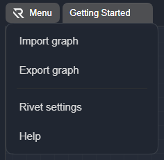

## Settings

Open Rivet settings from the app menu in the desktop app. In the browser-hosted app, open the top-bar **Menu** dropdown and choose **Rivet settings**.

 

### LLM

If you are using built-in providers for text generation, add your API keys to Rivet. The [LLM Chat Node](../node-reference/llm-chat.mdx) can use configured OpenAI, Anthropic, and Google keys, or it can expose an `API Key` input port for graph-provided keys. The OpenAI key is also used by the legacy [Chat Node](../node-reference/chat.mdx), the [Get Embedding Node](../node-reference/get-embedding.mdx), and OpenAI-backed paths.

In the `LLM` page in Settings, you can set OpenAI, Anthropic, Google, and custom-provider keys, plus the optional OpenAI organization ID. Alternatively, you may set `OPENAI_API_KEY`, `ANTHROPIC_API_KEY`, `GOOGLE_GENERATIVE_AI_API_KEY`, `CUSTOM_AI_API_KEY`, and `OPENAI_ORG_ID` environment variables. If you change environment variables after Rivet starts, restart Rivet so the Node executor and app settings can see the new values.

### LLM Providers

For new chat workflows, prefer [LLM Chat](../node-reference/llm-chat.mdx). It supports OpenAI, Anthropic, Google, and custom OpenAI-compatible providers from one node. Each node can either use a configured provider API key from Settings > LLM or expose an `API Key` input port. Custom providers first use the configured custom-provider key, then the environment variable named by the node's `API key env var name` setting, or an `API Key` input port. They have their own `Provider base URL` field, separate from the advanced base URL override for built-in providers.

### Plugin Settings

Plugins are installed into the Rivet app, not manually enabled per project. Install and remove app-level plugins from Settings > Plugins. Plugin-specific API keys and other configuration live in Settings > Plugins settings.

Project files still contain a `plugins` list, but Rivet derives that list from actual plugin nodes in the project's graphs. Adding a plugin makes its nodes available everywhere; adding one of those nodes to a graph makes the current project declare the plugin when saved.
