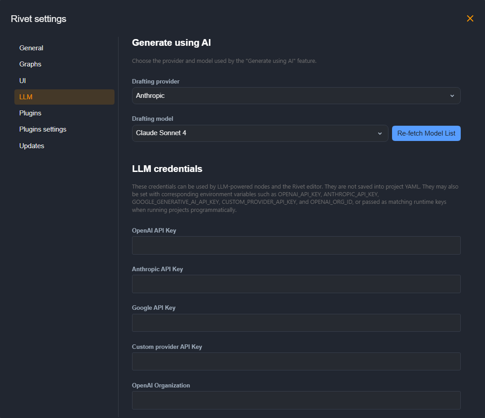

## Settings

Open the top-bar **Menu** dropdown and choose **Rivet settings**. On macOS, you can also use **Rivet → Settings…** in the native app menu. In Studio Server, these editor preferences are separate from the dashboard's **App Settings**, which configure the server.

### Add your provider credentials

If you are using built-in providers for text generation, add your API keys to Rivet. The [LLM Chat Node](../node-reference/llm-chat.mdx) can use configured OpenAI, Anthropic, and Google keys, or it can expose an `API Key` input port for graph-provided keys. The OpenAI key is also used by the legacy [Chat Node](../node-reference/chat.mdx), the [Get Embedding Node](../node-reference/get-embedding.mdx), and OpenAI-backed paths.

1. Select **LLM** in the settings sidebar.
2. Under **LLM credentials**, enter the API key for the provider you intend to use. You do not need keys for every provider. **OpenAI Organization** is optional.
3. Close the settings modal and select the matching provider and model in an **LLM Chat** node. Settings changes are saved as you edit; there is no separate Save button in this modal.

The **Generate using AI** section above the credentials selects the **Drafting provider** and **Drafting model** for the editor's AI generation feature. Your graph's LLM Chat nodes have their own provider and model choices.

Credentials entered here are not saved into project YAML. Configure credentials for the environment that runs your project when moving it to another machine or deploying it to Studio Server.

### Provider options and environment variables

For custom OpenAI-compatible providers, set the node's **Provider base URL** as well as its model and credentials. See [LLM Chat](../node-reference/llm-chat.mdx) for API Key inputs and named credential options, including selecting between multiple accounts for the same provider.

For execution environments that supply credentials through environment variables, the default names are:

| Credential | Environment variable | Programmatic runtime key |
| --- | --- | --- |
| OpenAI | `OPENAI_API_KEY` | `openAiApiKey` |
| Anthropic | `ANTHROPIC_API_KEY` | `anthropicApiKey` |
| Google | `GOOGLE_GENERATIVE_AI_API_KEY` | `googleApiKey` |
| Custom provider | `CUSTOM_PROVIDER_API_KEY` | `customAiApiKey` |
| OpenAI organization | `OPENAI_ORG_ID` | `openAiOrganization` |

Environment variables must be available to the process running the workflow. Restart that app or server process after changing its environment. For application code, see [the Node integration guide](../api-reference/getting-started-integration.mdx).

### Plugin Settings

Plugins are installed into the Rivet app, not manually enabled per project. Install and remove app-level plugins from Settings > Plugins. Plugin-specific API keys and other configuration live in Settings > Plugins settings.

Project files still contain a `plugins` list, but Rivet derives that list from actual plugin nodes in the project's graphs. Adding a plugin makes its nodes available everywhere; adding one of those nodes to a graph makes the current project declare the plugin when saved.
